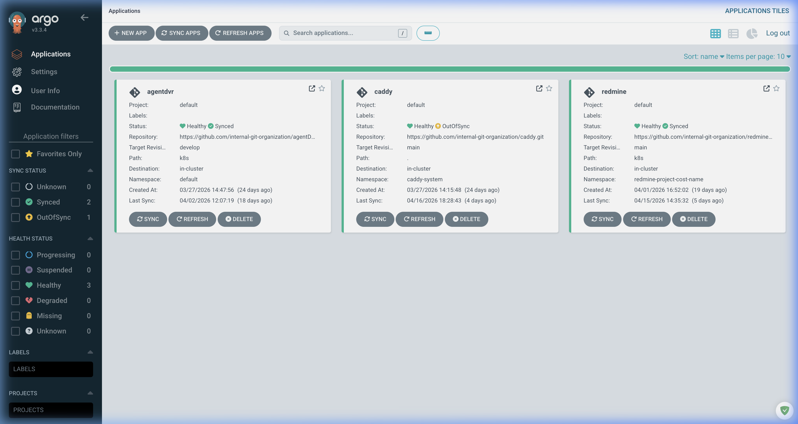
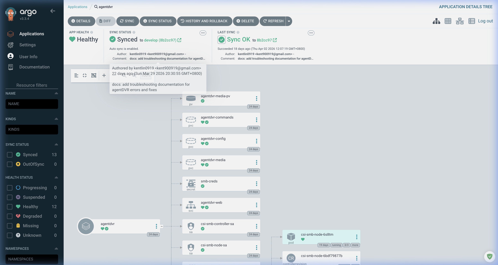
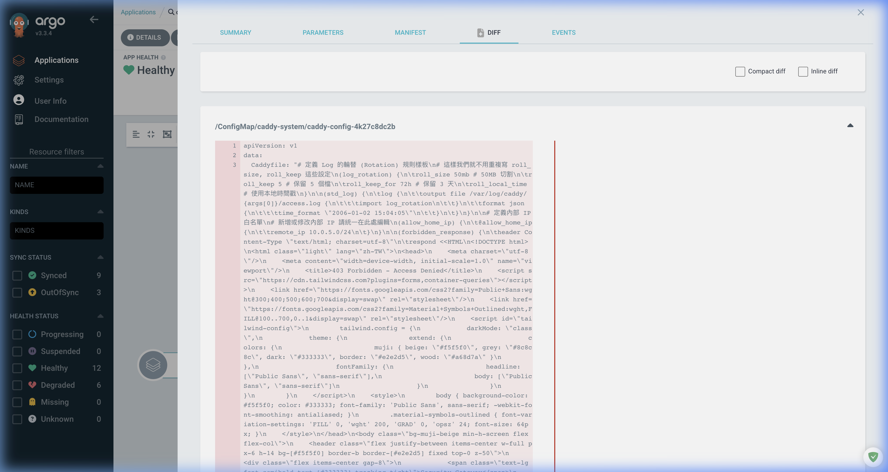
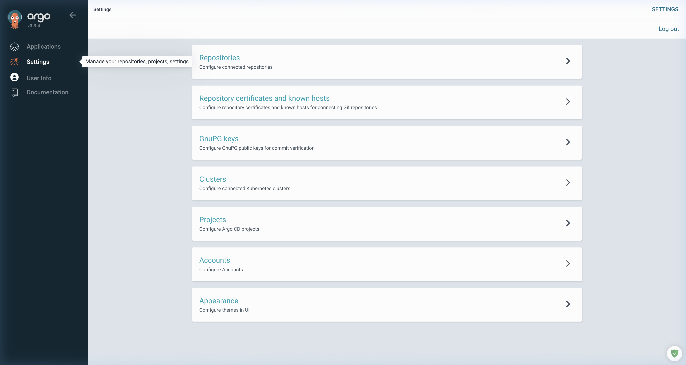
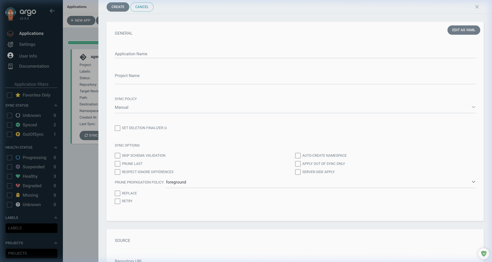
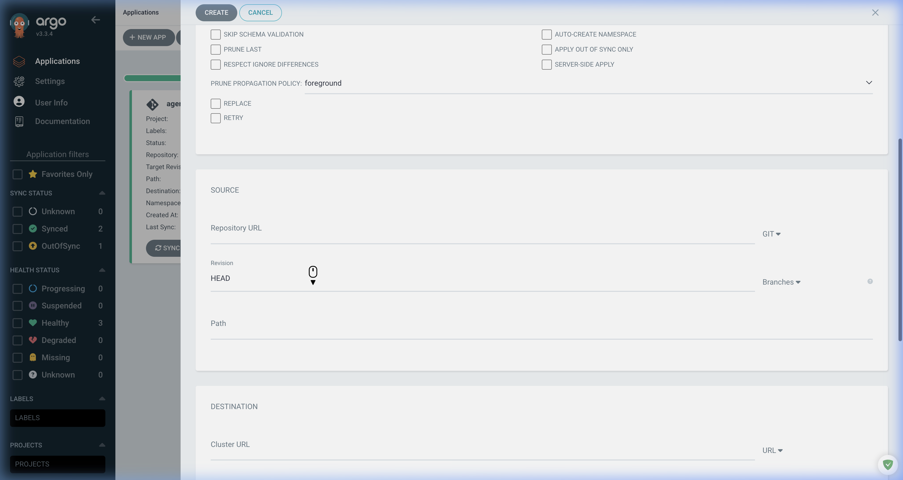

# ArgoCD 操作維運手冊 (ARGOCD_OPERATIONS.md)

本文件提供嘉鈊科技 K3s 叢集中 ArgoCD 的操作指引，涵蓋自動化佈署 (GitOps) 的核心邏輯與日常維運流程。

## 1. 系統概觀 (System Overview)

ArgoCD 是本專案的 GitOps 核心工具，負責監控 Git 儲存庫中的 YAML 配置，並確保 K8s 叢集的即時狀態與 Git 定義完全一致。

- **存取位置**: `https://10.0.5.201`
- **版本**: `v3.3.4`
- **核心功能**: 自動同步 (Auto-Sync)、視覺化資源樹、即時差異顯示 (Diff)、快速回滾 (Rollback)。



## 2. 應用程式管理 (Application Management)

### 2.1 資源樹狀圖 (Resource Tree)

以 `agentdvr` 為例，開發者可以在 ArgoCD 中直觀地看到該應用程式下屬的所有 K8s 資源及其健康狀態。



**核心資源說明 (agentdvr):**

- **Deployment**: 控制 Pod 的生命週期。
- **Service (MetalLB)**: 分配靜態 IP `10.0.5.204`。
- **ConfigMap/Secret**: 存放 Caddyfile 或 SMB 憑證 (`smb-creds`)。
- **PVC (Persistent Volume Claims)**: 包含 `agentdvr-config`、`agentdvr-media` 等持久化存儲空間。

---

## 3. GitOps 維運流程 (Operational Workflow)

### 3.1 同步狀態管理 (Sync Status)

當 Git 儲存庫有新的 Commit 時，ArgoCD 會自動偵測並標註狀態：

- **Synced**: 叢集與 Git 一致。
- **OutOfSync**: 偵測到差異，需手動或自動執行 `Sync`。

### 3.2 差異顯示 (Diff View)

以 `caddy` 為例，若出現 `OutOfSync`，可點擊 **DIFF** 按鈕查看具體差異。



> [!TIP]
> 在上圖中，可清楚看到 `ConfigMap` 中的 `Caddyfile` 有所變動。這也是排查佈署問題的最快速方式。

---

## 4. 基礎設施配置 (Infrastructure Settings)

### 4.1 儲存庫與叢集 (Repos & Clusters)

- **Repositories**: 連結至 GitLab/GitHub 上的 YAML 專案。
- **Clusters**: 本專案運行於 `in-cluster` 模式。



---

## 5. 建立新應用程式詳細指南 (New Application Granular SOP)

本章節提供 ArgoCD 建立介面的完整欄位導覽，解釋每個選項的意義以及資訊取得方式。

### 5.1 進入建立頁面

1. 進入 `Applications` 頁面。
2. 點選左上角 **+ NEW APP**。



### 5.2 GENERAL (一般設定) 詳解

| 欄位名稱 | 說明 | 如何取得 / 建議值 |
| :--- | :--- | :--- |
| **Application Name** | ArgoCD 顯示的 App 名稱。 | **建議**：使用專案代碼，如 `agentdvr-prod`。 |
| **Project** | 資源權限分組。 | **取得**：輸入 `default` (預設專案)。 |
| **Sync Policy** | 同步觸發模式。 | **Manual**: 適合正式環境，需人工確認後同步。<br>**Automatic**: 適合開發環境，偵測到 Git 更新即同步。 |

#### Sync Options (同步選項)

這是在 `Automatic` 模式中常見的細部設定：

- **Prune Last**: 在同步最後才刪除已不存在的資源，確保新資源先載入。
- **Self Heal**: 當手動在 K8s 叢集修改資源時，ArgoCD 會自動將其修正回 Git 定義的狀態。
- **Auto-Create Namespace**: **強烈建議勾選**。如果你的 YAML 定義了一個新的命名空間但叢集還沒有，選此項會自動建立。

### 5.3 SOURCE (原始碼設定) 詳解

| 欄位名稱 | 說明 | 如何取得 / 建議值 |
| :--- | :--- | :--- |
| **Repository URL** | 存放 K8s Manifest 的 Git 位址。 | **取得**：至 GitLab/GitHub 專案頁面複製 `Clone with HTTPs/SSH` 連結。 |
| **Revision** | 要佈署的代碼版本。 | **建議**：開發環境填 `develop` 分支；正式環境填 `main` 或特定的 `Tag` (如 `v1.2.0`)。 |
| **Path** | YAML 檔案所在的子目錄。 | **取得**：輸入 URL 後點擊下拉選單，選取包含 `deployment.yaml` 的資料夾。點選 `.` 代表根目錄。 |

### 5.4 DESTINATION (目標環境) 詳解

| 欄位名稱 | 說明 | 如何取得 / 建議值 |
| :--- | :--- | :--- |
| **Cluster URL** | 目標 K8s 叢集位址。 | **選擇**：`https://kubernetes.default.svc` (代表 ArgoCD 所在的當前叢集)。 |
| **Namespace** | 指定佈署到 K8s 內的哪一個空間。 | **取得**：確認專案預定的 Namespace（例如 `default` 或 `infra-system`）。 |



---

## 6. 資訊取得對照表 (Cheat Sheet)

若你不確定該填什麼，請參考下表尋找對應資訊：

1. **Git 資訊**: 檢查你的 `GitHub/GitLab` 儲存庫。確認 `k8s/` 或 `manifests/` 資料夾位置。
2. **Cluster 資訊**: 工具選單 `Settings` -> `Clusters` 可查看目前連接的叢集。
3. **專案規範**: 參考 `README.md` 或本專案中的 `CLUSTER_CONFIG.md` 確認命名規範。

## 6. 常見故障排除 (Troubleshooting)

### 6.1 基本排查

1. **同步失敗時**: 優先檢查 **EVENTS** 分頁，查看是否為 `ImagePullBackOff` 或 `Insufficient memory`。
2. **手動同步**: 若自動同步未開啟，點擊 `SYNC` -> `PRUNE` (刪除 Git 中已不存在的資源)。
3. **強制更新**: 若 Pod 卡住，可嘗試手動刪除 Pod 讓 ArgoCD 自動重建。

### 6.2 服務重啟指令 (官方推薦)

```bash
# 重啟 argocd-server (解決 401 驗證問題、配置變更後)
kubectl rollout restart deployment argocd-server -n argocd

# 重啟 repo-server (解決 CrashLoopBackOff、Volume 異常)
kubectl rollout restart deployment argocd-repo-server -n argocd

# 檢查所有 ArgoCD Pod 狀態
kubectl get pods -n argocd
```

### 6.3 進階 HA 調校

若 Application 數量較多，建議調整以下環境變數以避免 repo-server 負載過重：

| 環境變數 | 說明 | 建議值 |
|:---|:---|:---|
| `ARGOCD_RECONCILIATION_JITTER` | 同步間隔隨機抖動（秒） | `60` (預設) |
| `ARGOCD_GIT_ATTEMPTS_COUNT` | git ls-remote 重試次數 | `3` |

> [!TIP]
> **官方 HA 建議**: Jitter 可以分散 Application 刷新時機，避免重啟後所有 App 同時同步造成 repo-server 尖峰負載。
> 例如：timeout 5分鐘 + jitter 1分鐘 = 實際同步間隔在 5~6 分鐘之間隨機分布。
> — [來源: ArgoCD High Availability](https://argo-cd.readthedocs.io/en/stable/operator-manual/high_availability)

---

## 7. 相關文件

- [K3s 已知問題](./K3S_KNOWN_ISSUES.md) — 包含 ArgoCD repo-server CrashLoopBackOff 的詳細分析
- [重啟 SOP 手冊](./RESTART_SOP.md)
- [叢集配置](./CLUSTER_CONFIG.md)

---

> [!IMPORTANT]
> **文件維修說明**: 目前截圖路徑暫借用系統路徑，待資產權限調整後將改為專案相對路徑。
