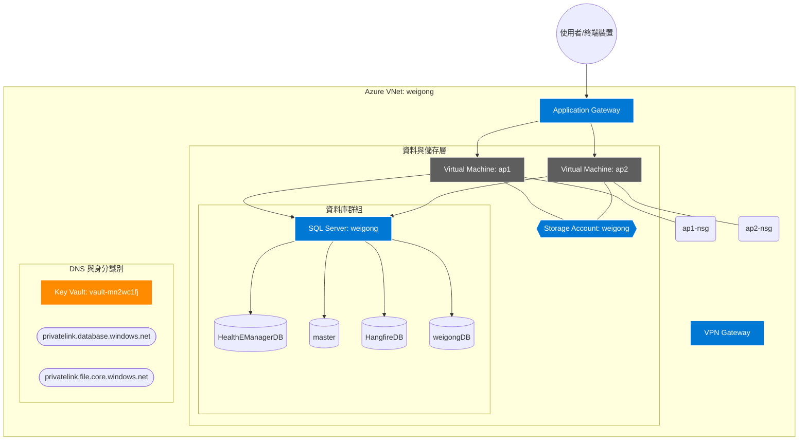

# Azure 雲端資源管理維運手冊

本文件記錄嘉鈊科技在 Azure 上的資源部署規範、網路架構與安全控管。

## 1. 資源階層結構 (Resource Hierarchy)

*   **訂閱 (Subscription)**: [填入 Subscription Name / ID]

*   **資源群組 (Resource Groups)**:
  *   `RG-INFRA-PROD`: 核心基礎架構（VNet: weigong, DNS, Key Vault）。
  *   `RG-DB-PROD`: 託管 SQL Server 與受管資料庫。
  *   `RG-APP-PROD`: 生產環境應用程式 (ap1, ap2) 與 Application Gateway。

## 2. 網路架構 (VNet & Subnet)

*   **虛擬網路 (VNet)**: `weigong`
  *   專案核心網路骨幹，連接前端應用層、資料層。

*   **子網路劃分 (Subnets)**:
  *   **AppGatewaySubnet**: 專供 Application Gateway 使用，不可放入其他資源（建議 /24 - /27）。
  *   **BackendSubnet**: 放置 `ap1` 與 `ap2` 應用伺服器。
  *   **DataSubnet**: 專供 SQL Server Private Endpoints 使用。

*   **流量管理 (Application Gateway)**:
  *   **功能**: Layer 7 負載平衡、SSL 終端 (SSL Termination) 與 WAF 攻擊防禦。
  *   **Backend Pool**: 包含 `ap1` (10.x.x.x) 與 `ap2` (10.x.x.x)。

*   **遠端連線**:
  *   **VPN Gateway**: 用於建立安全的管理者點對站 (P2S) 連線。
  *   **網路安全群組 (NSG)**: `ap1-nsg` 與 `ap2-nsg` 預設拒絕所有公網流量，僅允許 AppGW 之內網轉發。

## 3. 受管服務設定

*   **Azure SQL Server: weigong**:
  *   **資料庫清單**:
    *   `HealthEManagerDB`: 核心醫療管理資料。
    *   `master`: 系統管理資料庫。
    *   `HangfireDB`: 背景任務排程。
    *   `weigongDB`: 專案業務資料。
  *   **安全隔離**: 停用公網存取，僅透過 **Private Link** 解析連線。

*   **Azure Key Vault: vault-mn2wc1fj**:
  *   **功能**: 存放資料庫連線字串、TLS 憑證與重要身分祕密。
  *   **存取策略**: 僅允許伺服器的 Managed Identity 進行讀取。

*   **Private DNS Zones**:
  *   `privatelink.database.windows.net`: 指向 SQL Server 之私有 IP。
  *   `privatelink.file.core.windows.net`: 指向 Storage Account 之私有 IP。

*   **Managed Identity**: 伺服器透過「系統指派身分」認證，取代程式碼中硬編碼的密碼。

## 4. 監控與告警 (Azure Monitor)

*   **日誌管理**: 匯流入 Log Analytics 以進行端對端效能追蹤。

*   **成本預算告警 (Budgets)**: 設定當月支出達 80% 時發送電子郵件通知至 RD 部門。

*   **服務狀況監控 (Service Health)**: 追蹤 Azure 全球區域性服務中斷。

## 5. 權限控管 (RBAC)

*   **角色分配**: 採「最小特權原則 (PoLP)」。

*   **關鍵角色分配**:
  *   `Contributor`: 給予自動化部署 CI/CD 帳號。
  *   `Key Vault Secrets User`: 僅給予應用程式 Managed Identity。

## 6. 災難恢復與備份 (DR)

*   **備份政策**:
  *   **SQL 資料庫**: 啟用長期保留 (LTR) 與異地備份。
  *   **虛擬機器**: 使用 Azure Backup 指定每日 Snapshot 排程。

*   **還原流程序**: 定期進行資料完整性測試。

## 7. 維運常見問題 (Maintenance Tips)

*   **AppGW 探查失敗**: 檢查後端伺服器的 IIS/App 服務是否啟動，或 NSG 是否擋掉 65200-65535 通訊埠。

*   **SQL 連線逾時**: 確認 Private Endpoint 的 DNS 解析是否由 Private DNS Zone 正確承接。

## 8. 醫院目前詳細架構圖 (Hospital Detailed Infrastructure Diagram)

### 實際佈署細節架構圖 (Actual Deployment Infrastructure Diagram)

