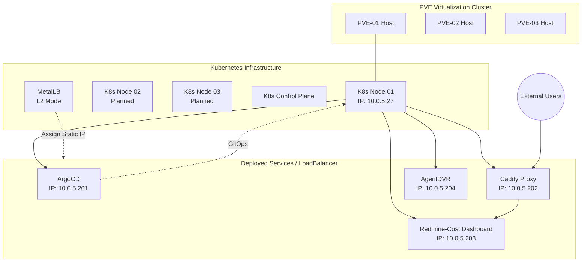

# K3s 叢集配置與遷移紀錄 (CLUSTER_CONFIG.md)

## 1. 系統架構圖 (System Architecture)

## 2. 叢集概況

| 項目 | 內容 |
|:---|:---|
| **Kubernetes 發行版** | K3s |
| **Node 名稱** | `gamma` |
| **Node IP** | `10.0.5.27` |
| **OS** | Ubuntu 22.04.5 |
| **Container Runtime** | containerd |
| **CNI (網路)** | Flannel VXLAN |
| **LoadBalancer** | MetalLB (L2 Mode) |
| **Storage** | SMB CSI + local-path |
| **K3s 配置路徑** | `/etc/rancher/k3s/config.yaml` |

- **K3s Node**: `10.0.5.27` (Node 名稱: `gamma`)
- **MetalLB (L2 Mode)**: 負責將 10.0.5.x 實體網段之 IP 分配給 Kubernetes 內部的 LoadBalancer Service
- **ArgoCD**: `10.0.5.201` (由 MetalLB 分配)
- **Caddy Proxy**: `10.0.5.202` (由 MetalLB 分配)
- **Redmine-Cost**: `10.0.5.203` (由 MetalLB 分配)
- **AgentDVR**: `10.0.5.204` (由 MetalLB 分配)
- **虛擬化平台**: 三台 Proxmox VE (PVE) 主機組成之叢集

> [!WARNING]
> **Storage 注意事項**: SMB CSI 在主機重啟時極易導致 kubelet 凍結，建議遷移至 NFS 或 local-path。詳見 [K3s 已知問題](./K3S_KNOWN_ISSUES.md)。

> [!IMPORTANT]
> K3s 內建的 ServiceLB (Klipper) 已停用，以避免與 MetalLB 衝突。配置於 `/etc/rancher/k3s/config.yaml` 中 `disable: [servicelb]`。

## 3. 關鍵遷移紀錄
...
- **目標環境**: K8s Deployment + Service (LoadBalancer/NodePort)。
- **設定檔管理**: 使用 ConfigMap 掛載 `Caddyfile`，確保設定變更後只需重啟 Pod 即可生效。

## 3. Redmine Dashboard 維護
- **後端**: 基於 Redmine API 的 Python/Node.js 服務。
- **部署**: 運行於 `mgmt` namespace。
