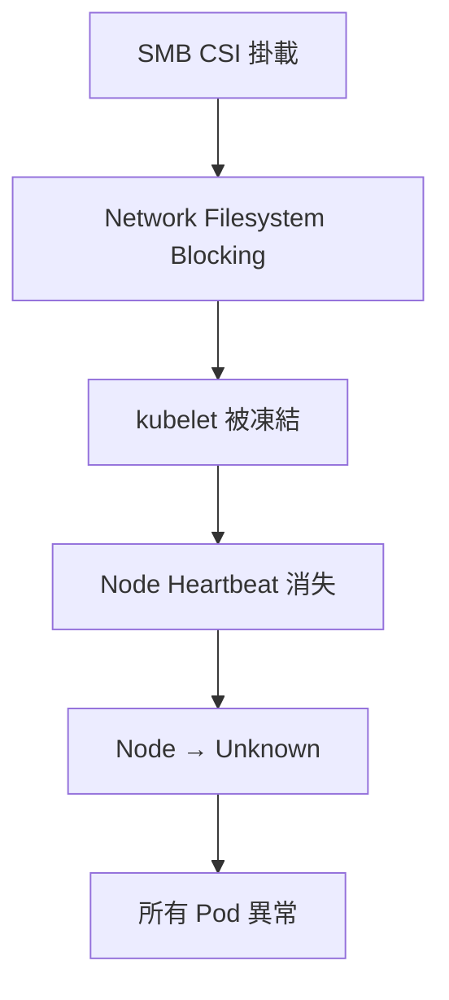
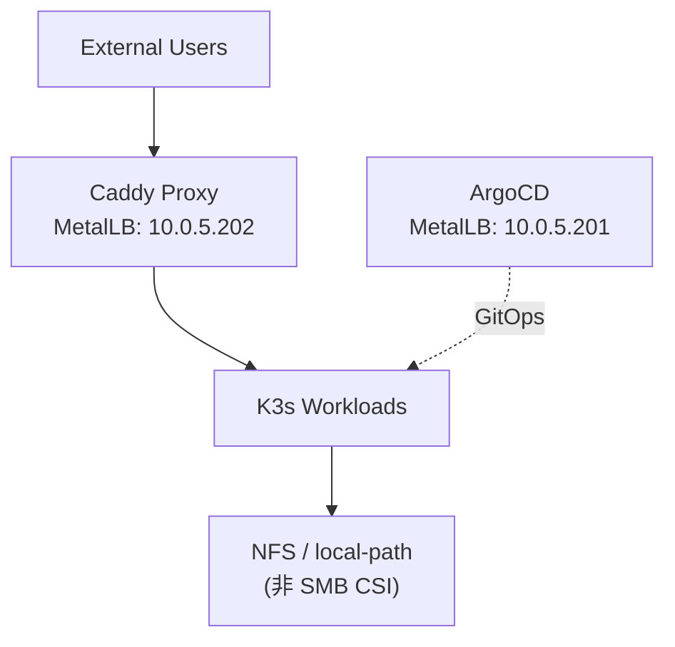

# K3s 已知問題與故障排除總整理

本文件記錄嘉鈊科技 K3s 叢集在實際維運中遭遇的重大問題、根因分析與解決方案，供接手人員參考。

> [!CAUTION]
> **最重要的一件事**: SMB CSI 會導致主機重啟時 kubelet 凍結，進而造成整個 Node 失聯。這是目前已知最嚴重的問題。

---

## 環境資訊

| 項目 | 內容 |
|:---|:---|
| Kubernetes 發行版 | K3s |
| Node 名稱 | `gamma` |
| OS | Ubuntu 22.04.5 |
| Container Runtime | containerd |
| CNI (網路) | Flannel VXLAN |
| LoadBalancer | MetalLB (L2 Mode) |
| GitOps | ArgoCD v3.3.4 |
| Storage | SMB CSI + local-path |
| 虛擬化平台 | Proxmox VE |

---

## 問題 1：SMB CSI 導致 Node Unknown（最嚴重）

### 現象

```text
Pod → Unknown
SSH → Broken pipe / Connection reset by peer
Node 狀態 → Unknown
```

### 根因分析



SMB 是網路檔案系統，當 SMB Server 連線不穩定或主機重啟時：
1. SMB CSI 嘗試掛載/重新掛載遠端共享資料夾
2. 掛載操作觸發 **filesystem blocking I/O**
3. kubelet 的磁碟容量檢查 (disk pressure) 被 blocking I/O 卡住
4. kubelet 無法回報心跳 → Control Plane 判定 Node Unknown

### 關鍵日誌特徵

```text
# etcd 延遲 (間接症狀)
apply request took too long
slow fdatasync

# kubelet 異常 (直接症狀)
Node Unknown
InvalidDiskCapacity
kubelet Starting（重複出現）
```

### 解決步驟

#### 緊急恢復

```bash
# 1. 透過 PVE 控制台 (非 SSH) 登入 K3s Node
#    因為 SSH 會因 kubelet 凍結而斷線

# 2. 強制卸載所有 SMB 掛載
sudo umount -f /var/lib/kubelet/pods/*/volumes/kubernetes.io~csi/smb-*
sudo umount -l /var/lib/kubelet/pods/*/volumes/kubernetes.io~csi/smb-*

# 3. 重啟 K3s 服務 (官方推薦方式)
sudo systemctl daemon-reload
sudo systemctl restart k3s.service

# 4. 等待節點恢復 (約 1-3 分鐘)
kubectl get nodes
```

> [!NOTE]
> **K3s 官方文件參考**: K3s 的所有服務設定變更均須透過 `systemctl daemon-reload && systemctl restart k3s.service` 套用。
> 若使用 openrc 系統則為 `rc-service k3s restart`。
> — [來源: K3s Configuration](https://docs.k3s.io/installation/configuration)

#### K3s Known Bug 提醒

> [!WARNING]
> K3s **v1.24.9+k3s1** 存在 containerd bug (containerd/7843)，導致每次 K3s 重啟時所有 Pod 都會被重建。
> 若使用該版本請升級至 **v1.24.9+k3s2** 或更新版本。
> — [來源: K3s Release Notes](https://docs.k3s.io/release-notes)

#### 長期解決方案

| 方案 | 推薦度 | 說明 |
|:---|:---|:---|
| **改用 local-path** | ⭐⭐⭐⭐⭐ | 單機最穩定，無網路依賴，K3s 預設內建 |
| **改用 NFS** | ⭐⭐⭐⭐ | 共享穩定，Linux 原生支援佳 |
| **改用 Longhorn** | ⭐⭐⭐⭐ | K8s 原生分散式儲存 |
| 繼續使用 SMB CSI | ⭐ | **不建議用於 Production** |

> [!WARNING]
> **SMB CSI 在 Production 環境中極度不穩定**，建議盡快遷移至 NFS 或 local-path。

---

## 問題 2：ArgoCD repo-server CrashLoopBackOff

### 現象

```text
argocd-repo-server → Init:CrashLoopBackOff
```

### 根因

Node 凍結後恢復時：
- Volume 狀態不正常
- Filesystem cache 異常
- Init container (`/bin/cp /usr/local/bin/argocd ...`) 執行失敗

### 解法

```bash
# 方法 1: 直接刪除 Pod，讓 Deployment 自動重建
kubectl delete pod -n argocd -l app.kubernetes.io/component=repo-server

# 方法 2: 透過 rollout restart 重啟整個 Deployment (ArgoCD 官方推薦)
kubectl rollout restart deployment argocd-repo-server -n argocd

# 等待新 Pod 啟動
kubectl get pods -n argocd -w
# 預期: repo-server → Running
```

### 進階調校（選配）

若 Application 數量較多，repo-server 重啟後可能出現同步風暴 (sync storm)，可設定 Jitter 來分散刷新壓力：

```bash
# 在 argocd-application-controller 中設定環境變數
# ARGOCD_RECONCILIATION_JITTER=60 (預設值，單位秒)
# 效果：讓每次同步間隔在 timeout ~ timeout+jitter 之間隨機分布
```

> [!TIP]
> **ArgoCD 官方建議**: `argocd-repo-server` 使用 `ARGOCD_GIT_ATTEMPTS_COUNT` 環境變數來配置 git ls-remote 的重試次數，
> 可降低因暫時性 Git 連線問題導致的 sync 失敗率。
> — [來源: ArgoCD HA Guide](https://argo-cd.readthedocs.io/en/stable/operator-manual/high_availability)

---

## 問題 3：ServiceLB (Klipper) 與 MetalLB 衝突

### 現象

```text
svclb-argocd-server → Pending
svclb-caddy → Pending
```

### 根因

K3s 內建 **ServiceLB (Klipper)** 作為 LoadBalancer Controller，同時又安裝了 **MetalLB**，導致兩個控制器互相衝突。

> [!NOTE]
> **K3s 官方說明**: 若要使用 MetalLB 等替代 Load Balancer，必須以 `--disable=servicelb` 停用內建 ServiceLB。
> K3s 預設打包了 containerd、Flannel、CoreDNS、Traefik 和 ServiceLB，所有這些都可以透過 `disable` 配置逐一關閉。
> — [來源: K3s Networking Services](https://docs.k3s.io/networking/networking-services)

### 解法

停用 K3s 內建的 ServiceLB：

```bash
# 編輯 K3s 配置
sudo nano /etc/rancher/k3s/config.yaml
```

建議的完整 K3s 配置檔範例 (根據官方文件格式)：

```yaml
# /etc/rancher/k3s/config.yaml
disable:
  - servicelb      # 停用內建 ServiceLB，改用 MetalLB
  # - traefik      # 若不使用 Traefik Ingress 也可停用
```

> [!TIP]
> K3s 還支援 **drop-in 配置檔**，可在 `/etc/rancher/k3s/config.yaml.d/` 目錄下新增 `.yaml` 檔案，
> 用 `+` 後綴來追加而非覆蓋配置，例如 `node-label+:` 可追加標籤。

重啟 K3s：

```bash
sudo systemctl daemon-reload
sudo systemctl restart k3s.service
```

> [!IMPORTANT]
> **此修改已完成**，但如果未來重裝 K3s，務必記得重新加入此設定。

---

## 問題 4：DaemonSet 無法 Scale

### 現象

```bash
kubectl scale daemonset csi-smb-node -n kube-system --replicas=0
# Error from server (NotFound)
```

### 原因

DaemonSet 本質是**每個 Node 運行一個 Pod**，不支援 `replicas` 機制。

### 正確做法

```bash
# 若要停止 DaemonSet，直接刪除
kubectl delete daemonset csi-smb-node -n kube-system

# 若要停止 SMB CSI 所有元件
kubectl delete deployment csi-smb-controller -n kube-system
kubectl delete daemonset csi-smb-node -n kube-system
```

---

## 問題 5：MetalLB IP 誤判與排查

### 現象

看到 `10.42.x.x` 以為 MetalLB 沒有作用。

### 原因

`10.42.x.x` 是 **Pod IP**（K3s Flannel 內部網段），不是 MetalLB 分配的 External IP。

### 正確確認方式

```bash
# 查看 Service 的 EXTERNAL-IP 欄位
kubectl get svc -A --field-selector spec.type=LoadBalancer

# 正常結果範例
# NAME            TYPE           CLUSTER-IP    EXTERNAL-IP   PORT(S)
# argocd-server   LoadBalancer   10.43.x.x     10.0.5.201    443/TCP
# caddy           LoadBalancer   10.43.x.x     10.0.5.202    80/TCP

# 查看 MetalLB Speaker 廣播事件
kubectl describe svc <service-name>
# 應看到類似: "announcing from node "gamma" with protocol "l2""
```

### MetalLB 故障排查指南（來自官方文件）

> [!NOTE]
> **MetalLB 官方澄清**: 從節點內部能 ping 到 LoadBalancer IP **不代表 MetalLB 正常運作**，
> 那只證明了 CNI 在工作。必須從外部實際訪問服務來驗證。
> 另外，**直接 ping Service IP 是無效的**，必須透過對應的 Port 來訪問。
> — [來源: MetalLB Troubleshooting](https://metallb.io/troubleshooting/)

MetalLB 由兩個元件組成：
- **controller**: 負責 IP 分配。若 Service 沒有取得 IP，應檢查 controller 日誌。
- **speaker**: 負責 L2/BGP 廣播。若 IP 已分配但外部無法連線，應檢查 speaker 日誌。

### ⚠️ 單節點叢集 MetalLB 不廣播的常見原因

若 MetalLB 在 K3s 單節點叢集中不廣播服務，請檢查節點是否被標記為：

```bash
# 檢查此 label 是否存在
kubectl get node gamma -o jsonpath='{.metadata.labels}' | grep exclude-from-external-load-balancers
```

若存在 `node.kubernetes.io/exclude-from-external-load-balancers` 標籤，MetalLB 會跳過該節點。
解法：移除標籤或在 speaker 加上 `--ignore-exclude-lb` 旗標。

### MetalLB 配置驗證

```bash
# 檢查 MetalLB 配置是否有效 (透過 Prometheus 指標)
# metallb_k8s_client_config_stale_bool = 1 代表配置過期

# 檢查 controller 日誌
kubectl logs -n metallb-system -l app=metallb,component=controller --tail=50

# 檢查 speaker 日誌
kubectl logs -n metallb-system -l app=metallb,component=speaker --tail=50
```

> [!TIP]
> MetalLB 配置無效時的行為是**標記為 stale 並繼續使用上一個有效配置**，不會中斷服務。
> 日誌中出現 `failed to parse the configuration` 即為配置錯誤徵兆。

### 嘉鈊 MetalLB 配置範例

```yaml
# IPAddressPool 定義
apiVersion: metallb.io/v1beta1
kind: IPAddressPool
metadata:
  name: gamma-pool
  namespace: metallb-system
spec:
  addresses:
    - 10.0.5.200-10.0.5.210
---
# L2Advertisement 定義
apiVersion: metallb.io/v1beta1
kind: L2Advertisement
metadata:
  name: default
  namespace: metallb-system
spec:
  ipAddressPools:
    - gamma-pool
```

### IP 類型對照表

| IP 類型 | 網段範例 | 用途 | 分配者 |
|:---|:---|:---|:---|
| Pod IP | `10.42.x.x` | K3s 內部 Pod 通訊 | Flannel |
| ClusterIP | `10.43.x.x` | Service 內部入口 | kube-proxy |
| External IP | `10.0.5.x` | 對外服務入口 | MetalLB |

---

## 重要 Kubernetes 概念備忘

### MetalLB 僅管理 LoadBalancer 類型 Service

```yaml
# 只有這種類型會被 MetalLB 分配 External IP
spec:
  type: LoadBalancer
```

| Service | Type | 會有 External IP? |
|:---|:---|:---|
| argocd-server | LoadBalancer | ✅ |
| argocd-redis | ClusterIP | ❌ |
| argocd-repo-server | ClusterIP | ❌ |

### 主機重啟後的 SMB 掛載處理

> [!CAUTION]
> **每次主機重啟後，都必須檢查 SMB 掛載狀態！** 這是目前最常遇到的問題。

```bash
# 檢查是否有卡住的 SMB 掛載
mount | grep cifs

# 若有卡住的掛載，強制卸載
sudo umount -f <mount-point>
sudo umount -l <mount-point>  # lazy unmount 作為備選

# 確認 kubelet 正常
sudo systemctl status k3s
```

---

## 建議的 Production 架構

### 🚫 應避免

```
K3s + SMB CSI + etcd + 全部同一台
```

### ✅ 建議架構



---

## 相關文件

- [重啟 SOP 手冊](./RESTART_SOP.md) — 包含 SMB 掛載卡住時的重啟流程
- [K8s 叢集操作手冊](./K8S_OPERATIONS.md)
- [ArgoCD 操作維運手冊](./ARGOCD_OPERATIONS.md)
- [叢集配置與遷移紀錄](./CLUSTER_CONFIG.md)

---

*嘉鈊科技 (Gamma Technology) - 內部機密文件*
*最後更新: 2026-04-29*
