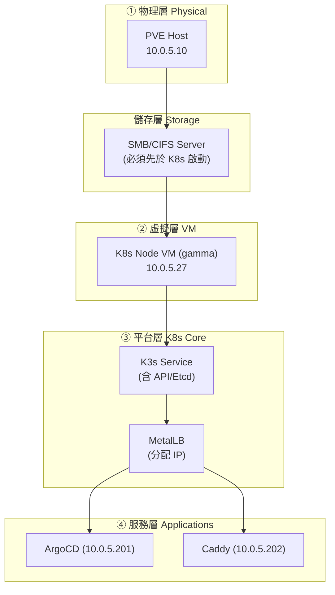

# 虛擬層重啟 SOP (Restart Standard Operating Procedure)

本文件定義嘉鈊科技虛擬化基礎設施的**完整重啟流程**，涵蓋 PVE 節點、K3s 叢集以及部署於其上的關鍵服務 (Caddy、ArgoCD 等)。

> [!CAUTION]
> **嚴禁在未完成本文件所有前置檢查的情況下直接重啟任何節點或服務。** 錯誤的重啟順序可能導致資料遺失或服務長時間中斷。

---

## 1. 架構總覽與依賴順序

重啟順序必須遵循**由下往上**的依賴層級：
`物理層 (PVE Host) → 儲存層 (SMB Server) → 虛擬層 (K8s VM) → 平台層 (K8s Core) → 服務層`



---

## 2. PVE 節點重啟 (PVE Host)

### 2.1 前置檢查 (確保資料安全)
在重啟實體機前，必須確認備份狀態。
1.  **Web UI 確認**: 點擊 `Datacenter` -> `Backup` -> `Summary`，確認最近一次備份狀態為 `OK`。
2.  **CLI 確認**: 
    ```bash
    # 檢查 Proxmox Backup Server (PBS) 任務
    pvesh get /nodes/localhost/tasks --limit 10 | grep -E "vzdump|OK"
    ```

### 2.2 重啟流程

#### 方案 A：Web UI 操作 (推薦)
1.  **通知**: 在群組告知維護開始。
2.  **關閉 VM**: 選取 VM `gamma (100)` -> `Shutdown` (等待圖示變紅)。
3.  **重啟 Host**: 點擊左側 Node `pve` -> 右上角 `Reboot` -> 確認。

#### 方案 B：CLI 操作 (緊急)
```bash
# 1. 關閉 K8s 虛擬機
qm shutdown 100 && qm wait 100

# 2. 執行重啟
reboot
```

---

## 3. K3s 叢集恢復 (最關鍵：處理 SMB)

當 PVE 重啟完畢，啟動 `gamma` VM 後，請務必遵循以下「防凍結」步驟。

### 3.1 啟動 VM 與處理掛載
1.  **啟動 VM**: Web UI 點擊 `gamma` -> `Start`。
2.  **登入方式**: 
    - **優先使用 PVE 控制台**: 點擊 `gamma` -> `Console` (以免 SSH 因掛載卡住而無法登入)。
3.  **⚠️ 強制處理 SMB 掛載 (重啟後必做)**:
    ```bash
    # 檢查掛載是否卡住 (若執行此指令超過 5 秒沒反應，代表已卡住)
    timeout 5s df -h | grep cifs
    
    # 若卡住，強制卸載所有 SMB 磁碟
    sudo umount -f -l /var/lib/kubelet/pods/*/volumes/kubernetes.io~csi/pvc-*/mount
    ```

### 3.2 驗證 K3s 服務
```bash
# 重啟 K3s 以確保排除 Kubelet 凍結狀態
sudo systemctl restart k3s

# 檢查節點狀態
kubectl get nodes
# [預期輸出]: gamma   Ready   <none>   ...
```

---

## 4. 服務層驗證 (重啟後的健康檢查)

重啟完成後，請執行以下腳本快速驗證所有關鍵服務：

### 4.1 一鍵驗證腳本 (Copy & Paste)
```bash
echo "=== 1. 網路與 IP 分配檢查 ==="
kubectl get svc -A | grep -E "argocd-server|caddy"

echo "=== 2. Pod 運行狀態檢查 ==="
kubectl get pods -A | grep -v -E "Running|Completed"

echo "=== 3. ArgoCD 同步檢查 ==="
kubectl get app -n argocd
```

### 4.2 各服務驗證標準

| 服務 | 驗證方式 | 正常標準 (Expected) |
| :--- | :--- | :--- |
| **ArgoCD** | 瀏覽 `https://10.0.5.201` | 顯示登入畫面，App 狀態為 `Healthy` |
| **Caddy** | `curl -I http://10.0.5.202` | 回傳 `HTTP/1.1 200 OK` (或 301/404 取決於配置) |
| **MetalLB** | `kubectl logs -n metallb-system -l component=speaker` | 日誌顯示 `announcing from node "gamma"` |
| **SMB 儲存** | `kubectl describe pod <使用SMB的Pod>` | Events 無 `FailedMount` 錯誤 |

---

## 5. 故障處理 (快速排除)

### Q: K3s Node 顯示 `NotReady` 且 `kubectl` 指令非常慢？
*   **原罪**: 100% 是 SMB 伺服器無法連線。
*   **解法**: 先在 PVE 控制台強制 `umount` (見 3.1)，然後重啟 K3s 服務。

### Q: ArgoCD 裡面所有 App 都顯示 `Missing` 或 `Unknown`？
*   **原因**: `argocd-repo-server` 掛載 SMB 失敗。
*   **解法**: 
    ```bash
    kubectl rollout restart deployment argocd-repo-server -n argocd
    ```

---

## 📅 重啟紀錄表 (建議填寫)
*   **重啟時間**: `YYYY-MM-DD HH:mm`
*   **操作人**: `Name`
*   **SMB 掛載是否正常**: `Yes/No (若 No，是否已強制 umount)`
*   **所有業務服務是否回復**: `Yes/No`

---
*最後更新: 2026-04-29*
*相關文件: [K8S 維護手冊 (K8S_OPERATIONS.md)](./K8S_OPERATIONS.md)*
n 同步狀態
- [ ] **Step 16** — 驗證業務服務可正常存取 (Redmine-Cost, AgentDVR)
- [ ] **Step 17** — 在群組回報恢復完成

---

## 6. 常見故障排除

### 6.1 PVE 無法登入 Web UI
```bash
# SSH 進入節點檢查服務
systemctl status pveproxy
systemctl status pvedaemon
systemctl restart pveproxy
```

### 6.2 K3s Node 卡在 NotReady / Unknown
```bash
# 檢查 K3s 日誌
journalctl -u k3s -f --no-pager | tail -50

# ⚠️ 最常見原因：SMB 掛載卡住導致 kubelet 凍結
mount | grep cifs
sudo umount -f /var/lib/kubelet/pods/*/volumes/kubernetes.io~csi/smb-*
sudo umount -l /var/lib/kubelet/pods/*/volumes/kubernetes.io~csi/smb-*

# 重啟 K3s
sudo systemctl restart k3s

# 若 SSH 也斷線，透過 PVE 控制台登入操作
```

### 6.2.1 ArgoCD repo-server CrashLoopBackOff (SMB 後遺症)
```bash
# Node 凍結恢復後 repo-server 常因 volume 異常而 CrashLoop
kubectl delete pod -n argocd -l app.kubernetes.io/component=repo-server
# 等待自動重建為 Running 狀態
```

### 6.3 MetalLB 未分配 IP
```bash
# 檢查 MetalLB 控制器
kubectl logs -n metallb-system -l app=metallb,component=controller

# 確認 IP Pool 配置
kubectl get ipaddresspool -n metallb-system -o yaml
```

### 6.4 ArgoCD 同步失敗
```bash
# 查看 Application 事件
kubectl describe application <app-name> -n argocd

# 強制同步
kubectl patch application <app-name> -n argocd \
  --type merge -p '{"operation":{"sync":{"prune":true}}}'

# 或透過 Web UI: 點擊 App → SYNC → 勾選 PRUNE → SYNCHRONIZE
```

### 6.5 Caddy 代理回傳 502/503
```bash
# 檢查 Caddy Pod 日誌
kubectl logs -f -l app=caddy -n <namespace>

# 確認後端服務是否啟動
kubectl get endpoints -n <namespace>

# 確認 ConfigMap 中的 Caddyfile 配置正確
kubectl get configmap <caddy-configmap> -n <namespace> -o yaml
```

### 6.6 Pod 卡在 CrashLoopBackOff
```bash
# 查看 Pod 事件與日誌
kubectl describe pod <pod-name> -n <namespace>
kubectl logs <pod-name> -n <namespace> --previous

# 常見解法：檢查 Secret/ConfigMap 是否存在
kubectl get secret -n <namespace>
kubectl get configmap -n <namespace>
```

---

## 7. 緊急聯絡與回報

| 情境 | 處理方式 |
|:---|:---|
| PVE Host 硬體故障 | 聯繫機房管理員 / 硬體廠商 |
| K8s 叢集完全無法恢復 | 依據 PBS 備份還原 K8s Node VM |
| ArgoCD 資料遺失 | 重新從 Git 儲存庫同步所有 Application |
| 網路無法連通 | 檢查實體交換器與 VLAN 配置 |

---

## 相關文件

- [PVE 維運設定手冊](./PVE_ADMIN_GUIDE.md)
- [K3s 叢集操作手冊](./K8S_OPERATIONS.md)
- [K3s 已知問題與故障排除](./K3S_KNOWN_ISSUES.md) ⚠️ **必讀**
- [Caddy 反向代理設定](./CADDY_PROXY_CONFIG.md)
- [ArgoCD 操作維運手冊](./ARGOCD_OPERATIONS.md)
- [叢集配置與遷移紀錄](./CLUSTER_CONFIG.md)
- [K8s Secret 掛載手冊](./K8S_SECRET_MOUNT_GUIDE.md)

---

*嘉鈊科技 (Gamma Technology) - 內部機密文件*
*最後更新: 2026-04-29*
