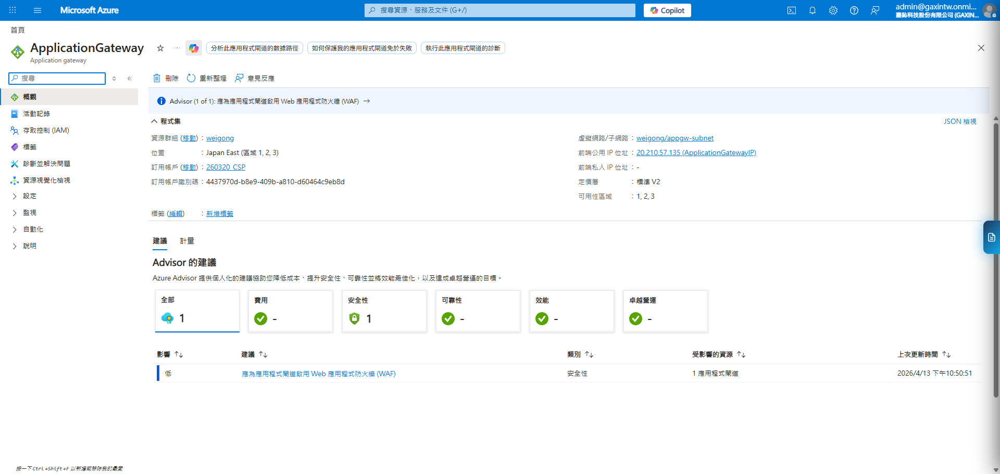
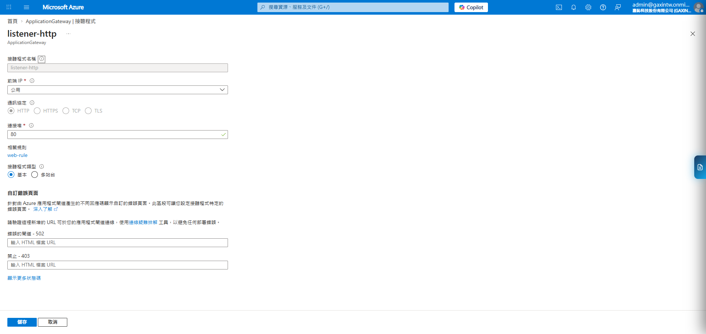
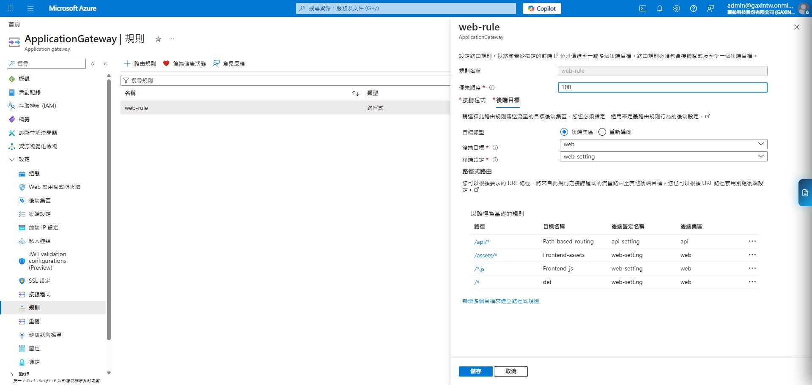
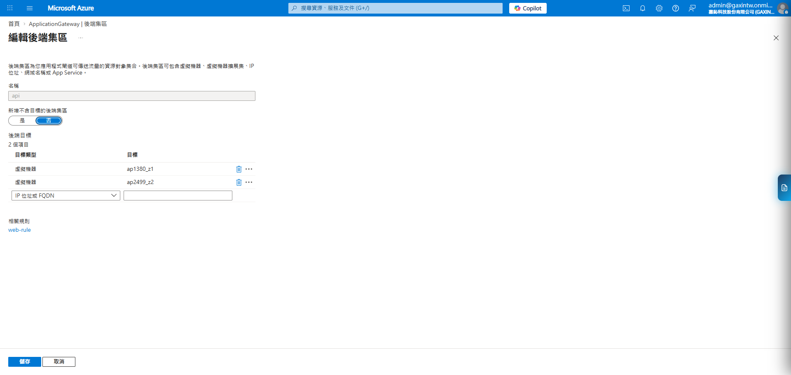
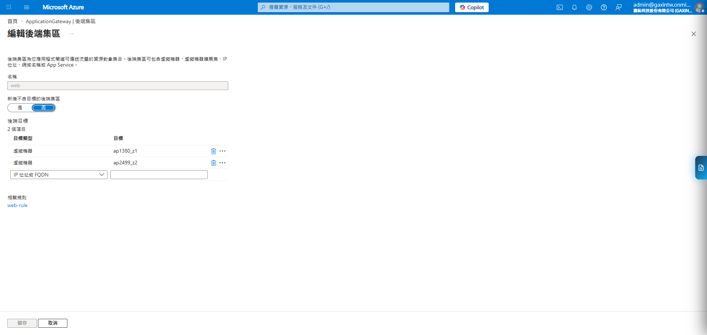

# Azure Application Gateway (ALB) 詳細設定與維運報告

## 1. 基礎架構細節 (Infrastructure Details)
本資源為 **Standard V2** 定價層，具備 L7 負載平衡與自動調整規模能力。

*   **資源名稱**: `ApplicationGateway`
*   **定價層 (Tier)**: Standard V2 (支援 Auto-scaling)
*   **公共 IP 名稱**: `ApplicationGatewayIP` (位址: `20.210.57.135`)
*   **虛擬網路 (VNet)**: `cmua-cmu-Network` (位址空間: `10.0.0.0/16`)
*   **部署區域**: Japan East (區域 1, 2, 3 跨可用性區域部署)

### 1.1 網路診斷結果 (2026-04-14)
*   **子網路狀態**: 共有 3 個子網路，NSG 欄位均未掛載子網路層級 NSG（隔離規則完全由 NIC 層級 NSG 控制）。
*   **後端 VM 映射**:
    *   `cmua-cmu-ap1`: NIC `cmua-cmu-ap1657_z1` | 私有 IP: `10.0.0.4`
    *   `cmua-cmu-ap2`: NIC `cmua-cmu-ap2770_z2` | 私有 IP: `10.0.0.5`
    *   兩者均位於同一子網路 `10.0.0.0/24` 中。

---

## 2. 接聽程式與規則 (Listeners & Rules)

### 2.1 接聽程式 (Listeners)
目前配置單一 HTTP 接聽點，接收所有網域的 80 埠流量。

*   **名稱**: `listener-http`
*   **協定**: HTTP (Port 80)
*   **類型**: 基本 (Basic) - 處理所有未加密的 Web 請求。

### 2.2 路由規則 (Routing Rules)
透過 **路徑式路由 (Path-based Routing)** 實現前端與 API 的服務分離。下圖為 `web-rule` 的後端目標詳細設定，清楚定義了路徑分流。

| 優先順序 | 路徑模式 (Paths) | 後端集區 (Pool) | 後端設定 (Settings) |
| :--- | :--- | :--- | :--- |
| 1 | `/api/*` | `api` | `api-setting` |
| 2 | `/assets/*` | `web` | `web-setting` |
| 3 | `/*.js` | `web` | `web-setting` |
| 預設 | `/*` | `web` | `web-setting` |

---

## 3. 後端集區與通訊配置 (Backend Config)

### 3.1 後端集區 (Backend Pools)
系統根據功能將後端 VM 劃分為兩個邏輯集區，各自包含特定的目標 IP 或資源。

*   **api**: 專門處理 `/api/*` 路徑下的業務邏輯。

*   **web**: 負責承載前端靜態檔案、assets 及 JS 腳本。

### 3.2 後端設定細節 (Backend Settings)
定義了 Gateway 與 VM 之間的私網通訊協議與埠號。

*   **api-setting**: 導向 **Port 60001**，啟用 Cookie 親和性，關聯健康探查 `backend`。
*   **web-setting**: 導向 **Port 60011**，啟用 Cookie 親和性，關聯健康探查 `web`。

---

## 4. 安全性分析與建議
1.  **WAF 缺失**: 應啟用 **Web 應用程式防火牆**。
2.  **明文傳輸風險**: 目前僅有 Port 80 接聽程式，應立即配置 **HTTPS (443)** 並匯入憑證。
3.  **健康探查**: 已配置自訂探查 (`backend` / `web`)，建議確認探查路徑是否正確對應後端健康檢查 API。

---

## 5. 健康狀態探查 (Health Probes)
根據 2026-04-14 實體環境截圖，目前配置了兩個健康探查：

| 參數項目 | 探查 1: `web` | 探查 2: `backend` |
| :--- | :--- | :--- |
| **通訊協定** | HTTP | HTTP |
| **主機 (Host)** | `10.0.1.5` | `10.0.1.4` |
| **路徑 (Path)** | `/` | `/API/app/latest` |
| **間隔 (Interval)** | 30 秒 | 100 秒 |
| **逾時 (Timeout)** | 30 秒 | 100 秒 |
| **狀況不良閾值** | 3 次 | 3 次 |
| **狀態碼相符** | 200-399 | 200-399 |
| **關聯後端設定** | `web-setting` (60011) | `api-setting` (60001) |

---

## 6. 現有問題分析與診斷報告 (Troubleshooting)

基於 2026-04-14 的深度診斷，確認以下問題與原因：

### 6.1 NSG 規則殘缺 (影響服務連通)
*   **ap1-nsg**: Inbound/Outbound 有 60011，但缺 **60001**。
*   **ap2-nsg**: Inbound 有 60011，但缺 **60001**；Outbound 則完全沒有自訂規則（60011/60001 均未開）。

### 6.2 Application Gateway 健康狀態異常
1.  **web pool (狀態不明)**: 原因為 NSG 未開放 **65200-65535** (AGW v2 必要端口)，導致 Health Probe 無法執行。
2.  **cmua-cmu pool (port 60001) (狀況不良)**: 原因為探查 `/API/app/latest` 回傳 **HTTP 401 Unauthorized**，超出了 AGW 預設接受的 200-399 範圍。
3.  **api pool (無流量)**: 原因為該 Pool **完全沒有關聯任何路由規則**。

---
*分析更新日期: 2026-04-14*
*數據來源: Azure Portal 實體環境診斷與截圖分析*