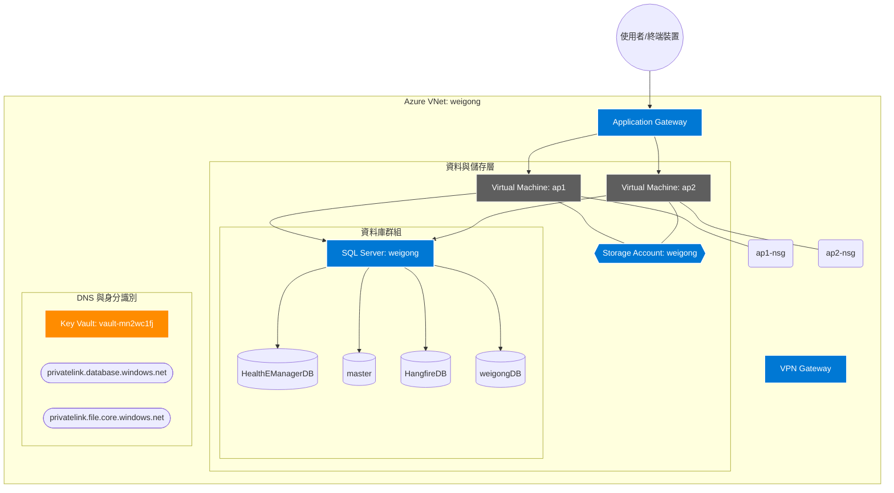

# Azure 雲端資源管理維運手冊

本文件記錄嘉鈊科技在 Azure 上的資源部署規範、網路架構與安全控管。

## 1. 資源階層結構 (Resource Hierarchy)

*   **訂閱 (Subscription)**: [填入 Subscription Name / ID]

### 1.1 資源命名規範 (Naming Conventions)

為了確保資源易於識別、分類及自動化管理，本專案遵循以下統一命名規則：

| 資源類型 | 命名格式 | 範例 | 說明 |
| :--- | :--- | :--- | :--- |
| **資源群組 (RG)** | `RG-<專案/功能>-<環境>` | `RG-DB-PROD` | 環境包含 PROD, DEV, STAGE |
| **虛擬網路 (VNet)** | `<專案名稱>` | `weigong` | 專案核心網路骨幹 |
| **子網路 (Subnet)** | `<功能名稱>Subnet` | `DataSubnet` | 依功能劃分，首字母大寫 |
| **虛擬機器 (VM)** | `<應用簡稱><編號>` | `ap1`, `ap2` | 簡短易記，編號從 1 開始 |
| **網路安全群組 (NSG)** | `<資源/VM>-nsg` | `ap1-nsg` | 標明受控對象 |
| **SQL Server** | `<專案名稱>` | `weigong` | 邏輯伺服器名稱 |
| **SQL Database** | `<名稱>DB` | `weigongDB` | 資料庫實體名稱 |
| **私人端點 (PE)** | `pe-<資源名稱>-<類型>` | `pe-weigong-db` | 標註連線目標 |
| **Key Vault (KV)** | `vault-<隨機字串>` | `vault-mn2wc1fj` | 須具備全域唯一性 |
| **儲存體帳戶 (SA)** | `<專案名稱><功能>` | `weigongsa` | **僅限小寫與數字**，不含特殊符號 |

#### 命名基本原則：
1.  **環境區分**：所有具備環境屬性的資源，必須帶上 `PROD` 或 `DEV` 後綴。
2.  **小寫限制**：針對 Azure 有特定限制的資源（如 Storage Account, DNS），一律使用**全小寫且不含中線**。
3.  **一致性**：私人端點 (PE) 的名稱必須與其指向的資源名稱保持關聯，方便排查網路路徑。

*   **資源群組 (Resource Groups)**:
  *   `RG-INFRA-PROD`: 核心基礎架構（VNet: weigong, DNS, Key Vault）。
  *   `RG-DB-PROD`: 託管 SQL Server 與受管資料庫。
  *   `RG-APP-PROD`: 生產環境應用程式 (ap1, ap2) 與 Application Gateway。

## 2. 網路架構 (VNet & Subnet)

*   **虛擬網路 (VNet)**: `weigong`
  *   專案核心網路骨幹，連接前端應用層、資料層。

*   **子網路劃分 (Subnets)**:
  *   **AppGatewaySubnet**: 專供 Application Gateway 使用，不可放入其他資源（建議 /24 - /27）。
  *   **BackendSubnet**: 放置 `ap1` 與 `ap2` 應用伺服器。
  *   **DataSubnet**: 專供 SQL Server Private Endpoints 使用。

*   **流量管理 (Application Gateway)**:
  *   **功能**: Layer 7 負載平衡、SSL 終端 (SSL Termination) 與 WAF 攻擊防禦。
  *   **Backend Pool**: 包含 `ap1` (10.x.x.x) 與 `ap2` (10.x.x.x)。

*   **遠端連線**:
  *   **VPN Gateway**: 用於建立安全的管理者點對站 (P2S) 連線。
  *   **網路安全群組 (NSG)**: `ap1-nsg` 與 `ap2-nsg` 預設拒絕所有公網流量，僅允許 AppGW 之內網轉發。

### 2.1 CMUA 虛擬網路建立與設定指引

`CMU Alliance` 專案的虛擬網路設定流程已獨立整理成作業文件。由於較早期文件曾使用 `weigong` 作為示意命名，但目前 `CMUA` 實際環境已改為 `cmua` 系列資源，後續建立或調整 VNet / Subnet 時，請以現場既有 `cmua` 網路資源為準，不要另外新建一套 `weigong` 命名的網路。

詳細建立步驟、子網路規劃、Private DNS / Private Endpoint 檢查與驗證流程，請直接參閱：

👉 **[Azure 虛擬網路建立與設定指南 (CMUA)](./procedures/AZURE_VNET_SETUP_GUIDE.md)**

## 3. 受管服務設定

*   **Azure SQL Server: weigong**:
  *   **定序設定 (Collation)**:
    *   **強制要求**: 建立資料庫時，必須手動將定序修改為 **`Chinese_Taiwan_Stroke_CI_AS`**。
    *   *原因*: 確保中文字元排序（按筆劃）與搜尋行為（不區分大小寫、區分腔調）符合台灣業務邏輯。
  *   **資料庫清單**:
    *   `HealthEManagerDB`: 核心醫療管理資料。
    *   `master`: 系統管理資料庫。
    *   `HangfireDB`: 背景任務排程。
    *   `weigongDB`: 專案業務資料。
  *   **安全隔離**: 停用公網存取，僅透過 **Private Link** 解析連線。

*   **Azure Key Vault: vault-mn2wc1fj**:
  *   **功能**: 存放資料庫連線字串、TLS 憑證與重要身分祕密。
  *   **存取策略**: 僅允許伺服器的 Managed Identity 進行讀取。

*   **Private DNS Zones**:
  *   `privatelink.database.windows.net`: 指向 SQL Server 之私有 IP。
  *   `privatelink.file.core.windows.net`: 指向 Storage Account 之私有 IP。

*   **Managed Identity**: 伺服器透過「系統指派身分」認證，取代程式碼中硬編碼的密碼。

## 4. 監控與告警 (Azure Monitor)

*   **日誌管理**: 匯流入 Log Analytics 以進行端對端效能追蹤。

*   **成本預算告警 (Budgets)**: 設定當月支出達 80% 時發送電子郵件通知至 RD 部門。

*   **服務狀況監控 (Service Health)**: 追蹤 Azure 全球區域性服務中斷。

## 5. 權限控管 (RBAC)

*   **角色分配**: 採「最小特權原則 (PoLP)」。

*   **關鍵角色分配**:
  *   `Contributor`: 給予自動化部署 CI/CD 帳號。
  *   `Key Vault Secrets User`: 僅給予應用程式 Managed Identity。

## 6. 災難恢復與備份 (DR)

*   **備份政策**:
  *   **SQL 資料庫**: 啟用長期保留 (LTR) 與異地備份。
  *   **虛擬機器**: 使用 Azure Backup 指定每日 Snapshot 排程。

*   **還原流程序**: 定期進行資料完整性測試。

## 7. 維運常見問題 (Maintenance Tips)

*   **AppGW 探查失敗**: 檢查後端伺服器的 IIS/App 服務是否啟動，或 NSG 是否擋掉 65200-65535 通訊埠。

*   **SQL 連線逾時**: 確認 Private Endpoint 的 DNS 解析是否由 Private DNS Zone 正確承接。

## 8. 醫院目前詳細架構圖 (Hospital Detailed Infrastructure Diagram)

### 實際佈署細節架構圖 (Actual Deployment Infrastructure Diagram)

### 8.1 架構設計核心原因分析 (Architecture Design Rationale)

根據上方的佈署架構圖，本專案採取此設計的核心理由如下：

1.  **縱深防禦的安全架構 (Defense in Depth)**
    *   **Application Gateway 作為唯一入口**：承接來自公網的流量，利用其 Layer 7 負載平衡與 WAF (Web Application Firewall) 功能，在攻擊抵達伺服器前先過濾惡意流量。
    *   **取消 VM 公網 IP (Private by Default)**：`ap1` 與 `ap2` 虛擬機器沒有直接對外的公用 IP。這大幅縮小了攻擊面，防止針對 RDP (3389) 或 HTTP (80/443) 的直接暴力破解攻擊。
    *   **NSG (網路安全群組) 隔離**：`ap1-nsg` 與 `ap2-nsg` 扮演微隔離角色，僅允許來自 App Gateway 子網的流量，進一步鎖定內網存取路徑。

2.  **資料庫的安全隔離 (Azure SQL Private Link)**
    *   **私人端點 (Private Endpoint)**：資料庫完全不暴露在網際網路上。伺服器必須透過 VNet 內部的私人 IP 連線，且 DNS 解析由 `privatelink.database.windows.net` (Private DNS Zone) 處理。

3.  **管理連線的安全化 (VPN Gateway)**
    *   **點對站 (P2S) 連線**：提供加密隧道，使 RD 部門或系統管理者能從公司或居家環境安全地存取內網資源進行維護，無需開啟高風險的公網存取權限。

4.  **身分與祕密管理的自動化**
    *   **Managed Identity & Key Vault**：透過虛擬機器的系統指派身分 (Managed Identity)，應用程式可以「免密碼」存取 Key Vault 內的資料庫連線字串或憑證，解決密碼硬編碼的安全風險。

5.  **高可用性與擴展性**
    *   **多 VM 備援**：配置 `ap1` 與 `ap2` 分散流量。配合 Application Gateway 的健康探查 (Health Probe)，當其中一台 VM 故障時，會自動將流量導向另一台，確保服務不中斷。

**總結**：此架構為典型的 Azure 醫院級專案標準實踐——**「外部流量嚴格過濾、內部通訊全私有化、身分驗證零信任」**，對於保護醫療敏感資料（如 `HealthEManagerDB`）是絕對必要的。

### 8.2 Azure SQL Database 建立與配置指南 (Setup Guide)

詳細的資料庫建立流程、網路安全配置（Private Link）以及定序設定，請參閱獨立的作業程序文件：

👉 **[Azure SQL Database 建立步驟教學](./procedures/AZURE_SQL_SETUP_GUIDE.md)**

## 9. 虛擬機器 (VM) 建立與配置指引 (Project: CMUA)

`CMU Alliance` 專案的 VM 建置流程已獨立整理成作業文件，內容以目前可確認的 `cmua` 規格為基準，包括：

* `Resource group`：`cmua-cmu`
* `VM naming`：`ap1` / `ap2`
* `Subnet`：`BackendSubnet`
* `Public IP`：`None`
* `NIC NSG`：`ap1-nsg` / `ap2-nsg`
* `SQL private connectivity`：需能私網連到 `cmua-cmu-db`

詳細建立步驟、欄位填寫原則與參考擷圖，請直接參閱：

👉 **[Azure VM 建立與配置指南 (CMUA)](./procedures/AZURE_VM_SETUP_GUIDE.md)**

## 10. Application Gateway (ALB) 建立與配置指引 (Project: CMUA)

`CMU Alliance` 專案的 ALB 建置流程已獨立整理成作業文件，內容以 `cmua-cmu` 資源群組為基準，包括：

* `Resource group`：`cmua-cmu`
* `ALB Name`：`cmua-cmu-alb`
* `Backend Pool`：包含 `cmua-cmu-ap1` / `cmua-cmu-ap2`
* `Frontend IP`：`cmua-cmu-frontend-ip` (Public IP)
* `Application Gateway subnet`：`appgw-subnet`，需為 ALB 專用子網路
* `Subnet sizing`：依 Microsoft Learn 至少 `/27`，實務上建議預留 `/24`
* `Public IP requirement`：`Standard` + `Static`

詳細建立步驟、配置原則、健康檢查、驗證方式與官方文件截圖，請直接參閱：

👉 **[Azure Application Gateway (ALB) 設定指南 (CMUA)](./procedures/AZURE_CMUA_ALB_SETUP_GUIDE.md)**

