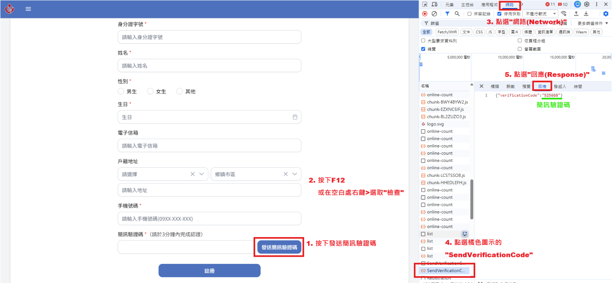
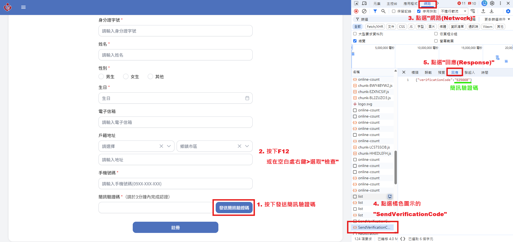
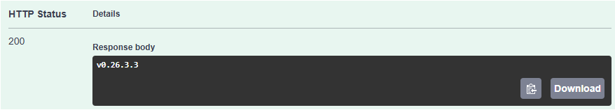

# 專案概觀 (Project Overview) - 中醫大聯盟 (CMU Alliance)

本文件摘要自 Redmine Wiki ([gx_cmuh_p1](https://redmine.viuto-aiot.com/projects/gx_cmuh_p1/wiki/Wiki))，包含專案站台資訊、維運流程及測試指南。

## 1. 專案站台建置資訊

| No. | 醫院名稱 | 縮寫 | 網址 | 連接埠 |
|:---:|:---|:---|:---|:---:|
| 1 | 中國醫藥大學附設醫院 | cmuh | https://cmuh.healthcare.dev.viuto-aiot.com | 60001 |
| 2 | 為恭紀念醫院 | weigong | https://weigong-healthcare.dev.viuto-aiot.com | 60002 |
| 3 | 中國醫藥大學北港附設醫院 | cmubh | - | 60003 |
| 4 | 亞洲大學附設醫院 | auh | - | 60004 |
| 5 | 台南市立安南醫院 | tmanh | - | 60005 |
| 6 | 中國醫藥大學兒童醫院 | cmuch | - | 60006 |

## 2. 議題處理流程 (Issue Handling Process)

### 新需求
- **UI/UX** 開發 issue，完成後轉交給 Rick 或 PM 確認，確認後分派。
- **後端** 處理完畢標註 50%，**App 或前端** 完成標註 90%。
- 狀態更改為「**待測試**」，上版後分派給 **QA**。
- QA 測試完畢後改為「**已完成**」且進度 100%。

### Bug 修復 (PM, QA, FE, BE 測試產出)
- 個別建立 issue，完成後轉交給 Rick 或 PM 確認並分派。
- 狀態更改為「**待測試**」，上版後分派給 **QA**。
- QA 測試完畢後改為「**已完成**」且進度 100%。

### QA 後續測試仍有問題
- 先轉移給 **FE** 判斷並分派。
- 重現後進行修復，或需要 RD 確認時標註「**待處理**」。
- RD 處理完畢後，狀態改為「**待測試**」，上版後分派給 **QA**。
- QA 驗證後改為「**已完成**」且進度 100%。

## 3. 測試與維運指南

### 3.1 取得驗證碼的方式 (OTP Retrieval)
在測試/開發環境中，可依下圖方式取得驗證碼：

*備註：詳細手機驗證碼測試方式請參考：*

### 3.2 系統版號確認方式 (Version Check)
1. **前端 Web**: 於頁面最右下角連點 2 下。
2. **後端 API**:
   - 進入 [Swagger 頁面](http://10.0.5.31:60003/swagger/index.html)。
   - 搜尋 `version`。
   - 找到 `/api/system-info/api-version`。
   - 點擊 `Try it out` -> `Execute`。
   - 查看 Response body 顯示的資訊。

## 4. 重要連結資源

- **全部文件路徑**: [Google Drive](https://drive.google.com/drive/folders/1T1lsMiFWz5gNP5HaEFzQFAjv-3geoanJ)
- **設計稿**: [Figma - 為恭醫院](https://www.figma.com/design/dfUiHoOwnIvc2BP96dD5sX/%E7%82%BA%E6%81%AD%E9%86%AB%E9%99%A2?node-id=15036-224262&t=4ofZW9MXslBxHgpO-4)
- **正式上線事前準備**: [Redmine #11531](https://redmine.viuto-aiot.com/issues/11531)
- **AZURE 使用時間紀錄**: [Google Sheets](https://docs.google.com/spreadsheets/d/1JENczYF76X2sHQ4p0-8nUY84Ms6Q6o8A/edit?usp=drive_link)
- **2.0 版本功能及各院使用權限**: [Wiki Page](https://redmine.viuto-aiot.com/projects/gx_cmuh_p1/wiki/20_%E7%89%88%E6%9C%AC%E5%90%84%E9%99%A2%E7%9A%84%E5%8A%9F%E8%83%BD%E9%A0%85%E7%9B%AE)

---
*更新日期：2026-04-13*
