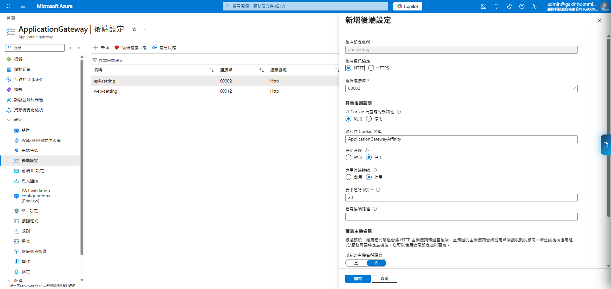

# Azure Application Gateway (ALB) 設定指南 (SOP)

> [!IMPORTANT]
> 本文件描述早期 `weigong` 命名空間下的 ALB 配置。若您是為了 **CMU Alliance (cmua-cmu)** 專案進行設定或維運，請優先參閱：
> 👉 **[Azure Application Gateway (ALB) 設定指南 (cmua-cmu 專屬)](./AZURE_CMUA_ALB_SETUP_GUIDE.md)**

本文件詳述 CMU Alliance 專案中 Azure Application Gateway 的核心配置步驟，供維運人員參考。本指南將深入展示各項設定內部的具體參數配置。

## 1. 資源概覽 (Resource Overview)
在 Azure 入口網站中搜尋 `ApplicationGateway`。此資源負責處理所有進入 `weigong` 虛擬網路的 Layer 7 流量。

*   **公用 IP**: `20.210.57.135`
*   **定價層**: Standard V2
*   **子網路**: `appgw-subnet`

---

## 2. 配置後端集區 (Backend Pools)
後端集區定義了流量導向的目標伺服器。目前分為 `api` 與 `web` 兩個集區。您可以點擊進入集區，查看或新增後端目標 (Target)。

*   **api 集區**: 包含處理 API 請求的 VM 實例。

*   **web 集區**: 包含處理前端靜態資源與網頁的 VM 實例。

---

## 3. 設定後端通訊 (Backend Settings)
此處定義了 Gateway 與後端實例之間的通訊協定與連接埠。下圖以 `api-setting` 為例，展示如何綁定 Cookie 親和性。

*   **api-setting**: 導向連接埠 `60002` (HTTP)，已啟用 Cookie 親和性。
*   **web-setting**: 導向連接埠 `60012` (HTTP)，已啟用 Cookie 親和性。

---

## 4. 配置接聽程式 (Listeners)
接聽程式決定 Gateway 在哪個連接埠接收流量。下圖顯示 `listener-http` 的詳細配置畫面。

*   **名稱**: `listener-http`
*   **協定**: HTTP (Port 80)
*   **類型**: 基本 (Basic)

---

## 5. 定義路由規則與路徑分流 (Routing Rules)
透過 **路徑式路由 (Path-based Routing)**，我們可以根據 URL 將請求導向不同的集區。點擊規則中的「後端目標 (Backend targets)」頁籤，可以清楚看到每一條路徑對應的處理集區。

### 關鍵路由路徑：
| 路徑 | 目標集區 | 後端設定 |
| :--- | :--- | :--- |
| `/api/*` | `api` | `api-setting` |
| `/assets/*` | `web` | `web-setting` |
| `/*.js` | `web` | `web-setting` |
| `/*` (預設) | `web` | `web-setting` |

---

## 6. 維運與安全建議 (Maintenance & Security)
根據當前設定分析，強烈建議進行以下調整：
1.  **啟用 HTTPS**: 建立 Port 443 接聽程式並上傳 SSL 憑證。
2.  **開啟 WAF**: 為了防禦 Web 攻擊，應將定價層升級並關聯 WAF 原則。
3.  **監控狀態**: 定期檢查「後端健康狀態」以確保 VM 響應正常。

---
*文件產生日期: 2026-04-13*
*製作工具: Gemini CLI (基於實體 Azure 環境細部截圖)*