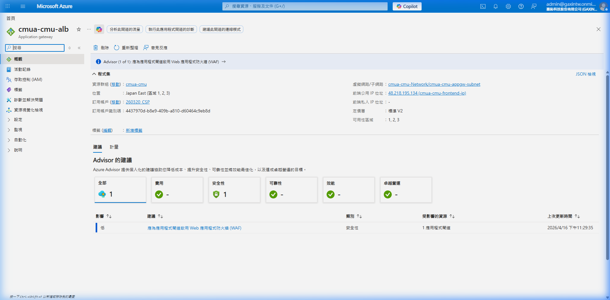
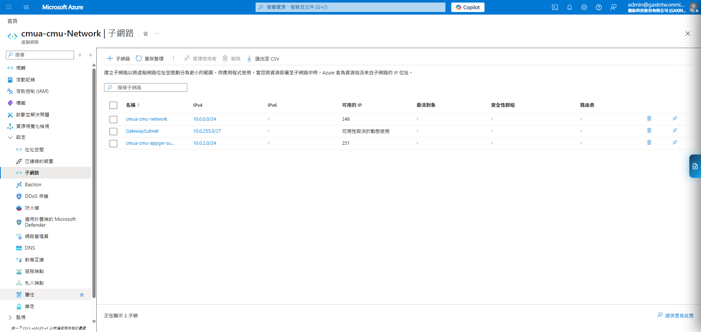
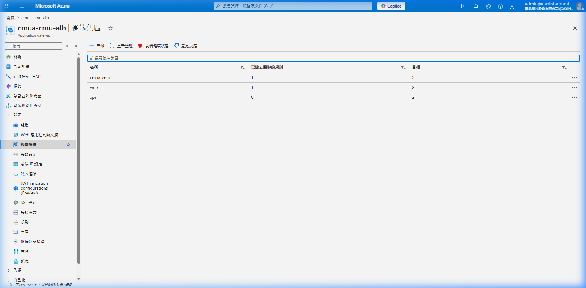
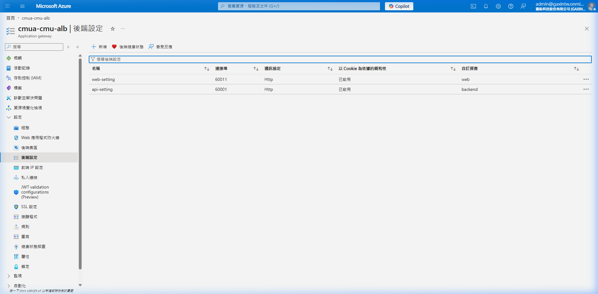
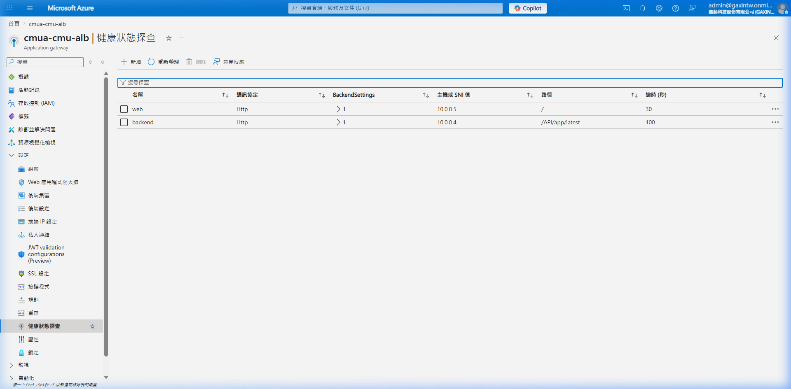
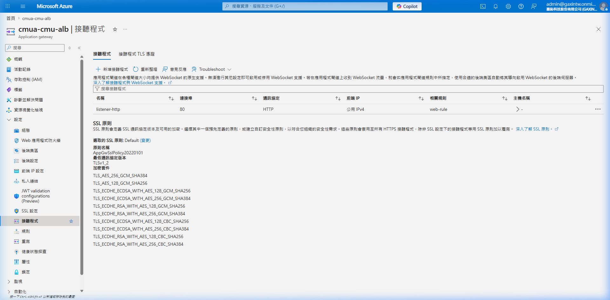
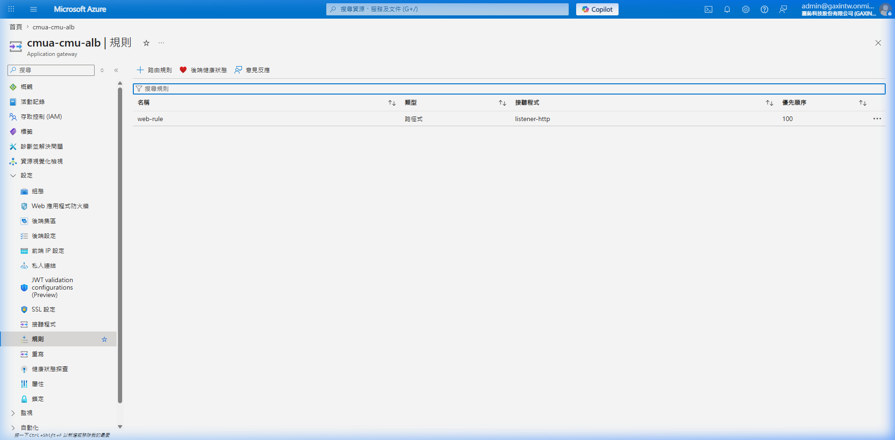

# Azure Application Gateway (ALB) 設定指南 (cmua-cmu 專屬資源集)

本文件提供 `cmua-cmu` 資源群組建立 Azure Application Gateway (ALB) 的可執行 SOP，適用於 `CMU Alliance` 專案目前的雙機應用架構。

本版已依 `2026-04-17` 透過實測截圖與 Microsoft Learn 官方文件整理，重點對齊下列要求：

* `Application Gateway v2` 需要使用 **專用子網路** (本專案命名為 `cmua-cmu-appgw-subnet`)。
* `Standard v2` 搭配公網前端時，應使用 **Standard / Static Public IP**。
* Application Gateway 子網路至少建議 `/27`，本專案目前配置為 `/24`。

## 1. 架構概觀 (Overview)

以下截圖顯示了目前 `cmua-cmu-alb` 的運行狀態與基本資訊：



## 2. 本專案目標配置 (Actual Configuration)

| 項目 | 設定值 | 說明 |
| :--- | :--- | :--- |
| Subscription | `260320 CSP` | 目前使用的訂閱 |
| Resource Group | `cmua-cmu` | CMUA Azure 資源群組 |
| Region | `Japan East` | 必須與既有網路與 VM 同區 |
| Application Gateway 名稱 | `cmua-cmu-alb` | 專案標準命名 |
| SKU / Tier | `Standard_v2` | 目前以 ALB 為目標，不含 WAF |
| Virtual Network | `cmua-cmu-Network` | 既有 VNet |
| ALB Subnet | `cmua-cmu-appgw-subnet` | ALB 專用子網路 |
| Frontend Public IP | `cmua-cmu-frontend-ip` | `Standard` + `Static` |
| Backend Pools | `web-pool`, `api-pool` | 目標 VM: `cmua-cmu-ap1`, `cmua-cmu-ap2` |
| Backend Settings | `web-setting`, `api-setting` | 服務埠號: `60011` (Web), `60001` (API) |
| Listeners | `web-listener`, `api-listener` | 分別監聽 `60011` 與 `60001` |
| Routing Rules | `web-rule`, `api-rule` | 將對應流量導向各 Pool |

## 3. 前置確認

建立前先完成以下檢查，否則容易在建立流程中卡住：

* [ ] 已確認操作帳號對 `cmua-cmu` 具備至少 `Network Contributor` 或更高權限
* [ ] `cmua-cmu-ap1`、`cmua-cmu-ap2` 皆已存在且狀態正常
* [ ] `cmua-cmu-Network` 與兩台 VM 位於同一個 `Japan East`
* [ ] 已確認應用實際對外服務埠號，例如 `80`、`8080` 或自訂 port
* [ ] 已確認健康檢查路徑，例如 `/health`、`/` 或應用可回 `200` 的 endpoint
* [ ] 已確認 NSG 沒有阻擋來自 Application Gateway 子網到後端 VM 的必要流量

## 4. 建立 ALB 專用子網路

根據 Microsoft Learn，Application Gateway v2 必須使用專用子網路；該子網路中不應放置其他 VM、Private Endpoint 或一般工作負載。

### 4.1 檢查既有子網路

1. 進入 Azure Portal。
2. 搜尋並開啟 `cmua-cmu-Network`。
3. 進入左側 `Subnets`。
4. 確認是否已存在 `cmua-cmu-appgw-subnet` (如下圖所示)。



### 4.2 建立子網路

若尚未建立，請新增：

| 欄位 | 建議值 |
| :--- | :--- |
| Name | `cmua-cmu-appgw-subnet` |
| Address range | `10.0.2.0/24` (依現場實際規劃) |
| Network security group | 先保持預設，避免自行加上過度限縮規則 |
| Route table / NAT gateway / service endpoint | 若無明確需求，先保持預設 |

### 4.3 子網路規劃原則

* 最低至少保留 `/27`
* 若考量 `Standard_v2` autoscaling 與 hitless maintenance，建議直接保留 `/24`
* 不可與 `BackendSubnet` 或資料庫 Private Endpoint 所在子網路重疊

## 5. 建立 Public IP

1. 於 Azure Portal 搜尋 `Public IP addresses`
2. 點選 `Create`
3. 填入下列值：

| 欄位 | 設定值 |
| :--- | :--- |
| Resource group | `cmua-cmu` |
| Name | `cmua-cmu-frontend-ip` |
| Region | `Japan East` |
| SKU | `Standard` |
| Assignment | `Static` |
| Availability zone | 依現場策略，若無特別要求可先維持預設 |

4. 完成後建立

## 6. 建立 Application Gateway

1. 搜尋 `Application gateways`
2. 點選 `Create`
3. 於 `Basics` 分頁填入：

| 欄位 | 設定值 |
| :--- | :--- |
| Subscription | 現場使用中的 CMUA 訂閱 |
| Resource group | `cmua-cmu` |
| Application gateway name | `cmua-cmu-alb` |
| Region | `Japan East` |
| Tier | `Standard V2` |
| Enable autoscaling | 建議開啟，Min instance 依現場容量需求 |
| Virtual network | `cmua-cmu-Network` |
| Subnet | `cmua-cmu-appgw-subnet` |
| Frontend IP type | `Public` |
| Public IP address | `cmua-cmu-frontend-ip` |

4. 進入 `Frontends` / `Configuration` 相關頁面時，確認 Portal 沒有自動替換掉既有命名
5. 完成建立

## 7. 建立 Backend Pool

進入 `Backend pools`，依照不同服務建立集區：



### 7.1 Web Pool
| 欄位 | 設定值 |
| :--- | :--- |
| Pool name | `web-pool` |
| Targets | `cmua-cmu-ap1` (10.0.0.4), `cmua-cmu-ap2` (10.0.0.5) |


### 7.2 API Pool
| 欄位 | 設定值 |
| :--- | :--- |
| Pool name | `api-pool` |
| Targets | `cmua-cmu-ap1` (10.0.0.4), `cmua-cmu-ap2` (10.0.0.5) |


操作原則：

* 優先使用 VM 綁定以維持動態 IP 對應
* 確認 Pool 已關聯至正確的 Routing rule (詳見第 10 節)

## 8. 建立 Backend Setting 與 Health Probe

進入 `Backend settings`，配置 Web 與 API 的後端連線參數：



### 8.1 關鍵配置說明
| 項目 | Web (`web-setting`) | API (`api-setting`) |
| :--- | :--- | :--- |
| Backend protocol | `HTTP` | `HTTP` |
| Backend port | `60011` | `60001` |
| Cookie-based affinity | `Disabled` | `Disabled` |
| Connection draining | `Enabled` (30s) | `Enabled` (30s) |



### 8.2 Health Probe (健康狀態探查)
| 項目 | `web-probe` | `api-probe` |
| :--- | :--- | :--- |
| Path | `/` | `/health` (需確認非 401 路徑) |
| Interval | 30s | 30s |
| Unhealthy threshold | 3 | 3 |

實務要求：
* Probe 路徑必須能在無須認證的情況下回傳 `200-399`。
* 若 API 端口有 401 問題，請開發人員提供專用的 `/ping` 或 `/health` 端點。

## 9. 建立 Listener

進入 `Listeners`，配置前端監聽埠號：



| 欄位 | Web (`web-listener`) | API (`api-listener`) |
| :--- | :--- | :--- |
| Frontend IP | `cmua-cmu-frontend-ip` | `cmua-cmu-frontend-ip` |
| Protocol | `HTTP` | `HTTP` |
| Port | `60011` | `60001` |
| Listener type | `Basic` | `Basic` |

備註：
* 目前先行配置 HTTP 版本以利測試，正式環境應升級為 HTTPS 並配置憑證。

## 10. 建立 Routing Rule

進入 `Rules`，將 Listener 與 Backend 進行綁定：



| 欄位 | Web (`web-rule`) | API (`api-rule`) |
| :--- | :--- | :--- |
| Priority | `100` | `110` |
| Listener | `web-listener` | `api-listener` |
| Backend target | `web-pool` | `api-pool` |
| Backend settings | `web-setting` | `api-setting` |

目前採用 `Basic` rule 以簡化初期配置。若未來需要 Path-based routing (例如同一 Listener 依 `/api` 導流)，再行調整。

## 11. 驗證流程

建立完成後，請至少完成以下驗證：

### 11.1 Azure Portal 驗證

* `Overview` 顯示 `Running` (參考第 1 節截圖)
* `Backend health` 看到 `cmua-cmu-ap1`、`cmua-cmu-ap2` 在兩個 Pool 中皆為 `Healthy`
* `Frontend public IP` 已綁定 `cmua-cmu-frontend-ip`
* `Listener`、`Backend setting`、`Rule` 命名均符合本 SOP (`web-*` / `api-*`)

### 11.2 應用驗證

1. 從公司可測網路或受控測試端對 Public IP 發送 HTTP 請求
2. 驗證首頁可正常回應
3. 若有健康檢查頁，直接測 probe path 是否為 `200`
4. 停用其中一台 VM 的網站服務，確認 ALB 會將不健康節點排除

### 11.3 VM 側驗證

在 `cmua-cmu-ap1`、`cmua-cmu-ap2` 上確認：

* 本機服務有在預期 port 上 listen
* Windows Firewall / NSG 沒有擋掉來自 `appgw-subnet` 的流量
* 若應用依賴 SQL，仍可私網連到 `cmua-cmu-db`

### 11.4 Backend VM 防火牆配置 (Windows Firewall)

兩台 VM (`10.0.0.4`, `10.0.0.5`) 必須開放 60011 與 60001 埠號。請以系統管理員權限開啟 PowerShell 執行：

```powershell
# 開放 Inbound (輸入)
New-NetFirewallRule -DisplayName "Allow 60011 Inbound" -Direction Inbound -Protocol TCP -LocalPort 60011 -Action Allow
New-NetFirewallRule -DisplayName "Allow 60001 Inbound" -Direction Inbound -Protocol TCP -LocalPort 60001 -Action Allow

# 開放 Outbound (輸出)
New-NetFirewallRule -DisplayName "Allow 60011 Outbound" -Direction Outbound -Protocol TCP -LocalPort 60011 -Action Allow
New-NetFirewallRule -DisplayName "Allow 60001 Outbound" -Direction Outbound -Protocol TCP -LocalPort 60001 -Action Allow

# 驗證規則
Get-NetFirewallRule | Where-Object { $_.DisplayName -like "Allow 6000*" }
```

### 11.5 NSG 規則修正步驟 (2026-04-14)

根據現有診斷結果（ap2 缺少 Outbound 規則等），應執行以下修正步驟：

1.  **ap1-nsg — 刪除誤加規則**: 刪除 `AllowGatewayManagerInbound` (Priority 330, 65200-65535)，使用者無此需求。
2.  **ap1-nsg — 新增 Inbound**: 名稱為 `cmua-cmu-api-input` | Port: `60001` | Priority: `330`。
3.  **ap1-nsg — 新增 Outbound**: 名稱為 `cmua-cmu-api-output` | Port: `60001` | Priority: `340`。
4.  **ap2-nsg — 新增 Inbound**: 名稱為 `cmua-cmu-api-input` | Port: `60001` | Priority: `320`。
5.  **ap2-nsg — 新續 Outbound (60011)**: 名稱為 `cmua-cmu-web-output` | Port: `60011` | Priority: `330`。
6.  **ap2-nsg — 新增 Outbound (60001)**: 名稱為 `cmua-cmu-api-output` | Port: `60001` | Priority: `340`。

### 最終 NSG 規則總表 (驗證基準)

| NSG | 方向 | 規則名稱 | Port | 狀態 |
| :--- | :--- | :--- | :--- | :--- |
| ap1-nsg | Inbound | `cmua-cmu-web-input` | 60011 | 原本已有 |
| ap1-nsg | Inbound | `cmua-cmu-api-input` | 60001 | ✅ 已新增 |
| ap1-nsg | Outbound | `cmua-cmu-web-output` | 60011 | 原本已有 |
| ap1-nsg | Outbound | `cmua-cmu-api-output` | 60001 | ✅ 已新增 |
| ap2-nsg | Inbound | `cmua-cmu-web-input` | 60011 | 原本已有 |
| ap2-nsg | Inbound | `cmua-cmu-api-input` | 60001 | ✅ 已新增 |
| ap2-nsg | Outbound | `cmua-cmu-web-output` | 60011 | ✅ 已新增 |
| ap2-nsg | Outbound | `cmua-cmu-api-output` | 60001 | ✅ 已新增 |

## 12. 常見失敗點

### 12.1 無法建立 Application Gateway

常見原因：

* `appgw-subnet` 不存在
* 子網路與其他子網重疊
* 子網路內已有不相容資源
* Region 與 VNet / Public IP 不一致

### 12.2 Backend 顯示 Unhealthy

常見原因：

* **NSG 擋住監控流量 (Skv v2)**：必須在 NSG 開放來源 `GatewayManager` 存取目的 Port `65200-65535`。
* **API 回傳 401**：AGW 預設接受 200-399。若 API 需要認證，請建立自訂 Health Probe 指向不需認證的路徑（如 `/health` 或 `/ping`）。
* **防火牆未開放**：未執行 11.4 節之 PowerShell 腳本。
* 後端 port 寫錯、Probe path 寫錯、VM 本身服務未啟動。

### 12.3 前端可連到 Public IP，但網站無法開啟

常見原因：

* **API Pool 未關聯規則**：確認 Rule 是否已配置 Path-based routing（例如 `/api/*` 指向 `api-pool`）。
* Listener 與 Rule 沒綁定成功。
* Backend setting 沒有指向正確的 backend pool。

## 13. 上線後建議補強

目前本 SOP 先滿足 `cmua-cmu` 可用的 ALB 最小配置，正式上線前建議再補：

1. 建立 `HTTPS listener (443)` 並掛入正式憑證
2. 規劃 `HTTP -> HTTPS redirect`
3. 若網站對外，評估升級為 `WAF_v2`
4. 將 Probe path 改為專用健康檢查端點，而非首頁
5. 建立 Azure Monitor / Alert 規則監控 Backend health 與 5xx

## 14. 交接紀錄

* 文件更新日期：`2026-04-14`
* 本次補強內容：整合 2026-04-14 之深度診斷報告、NSG 修正步驟與防火牆 PowerShell 腳本。

## 15. 待處理項目 (Pending Items)

1. **HTTPS 升級**: 目前僅配置 HTTP。需待申請 SSL 憑證後，補強 HTTPS Listener (443) 並設定 Redirect 規則。
2. **Web Application Firewall (WAF)**: 目前使用 Standard v2。若後續暴露於公網且涉及極機敏資料，建議評估開啟 WAF。
3. **Log Analytics**: 建議開啟 Diagnostic Settings 將 ALB 日誌導向 Log Analytics 以利查核存取紀錄。

---
*嘉鈊科技 (Gamma Technology) - 內部機密文件*
