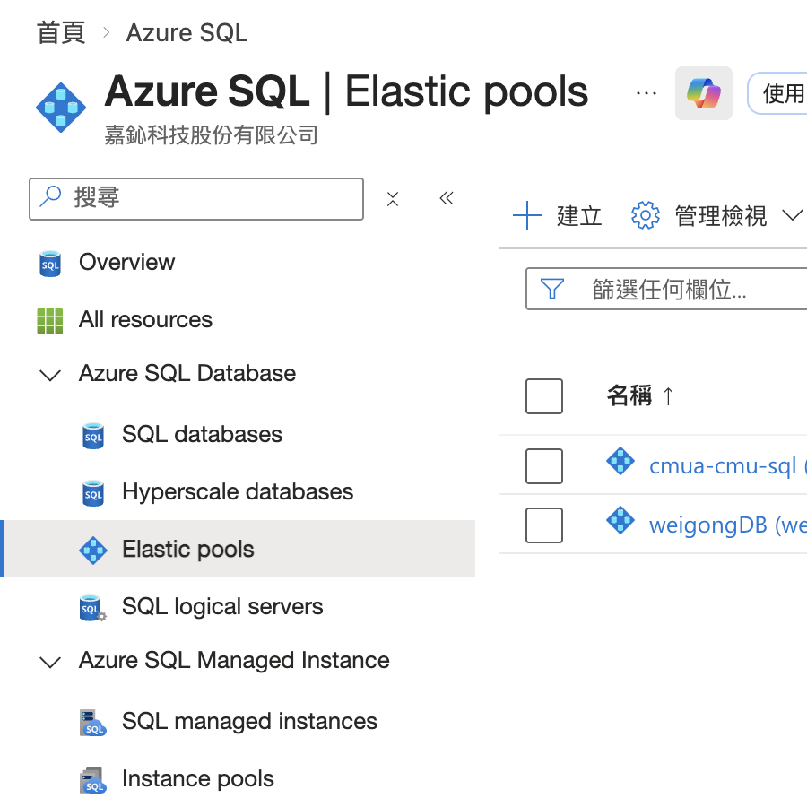
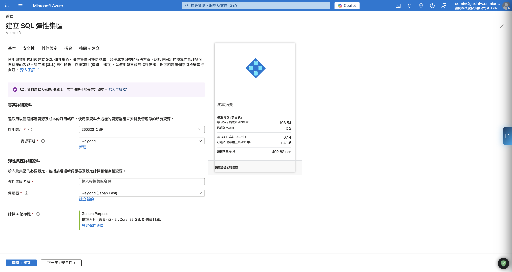
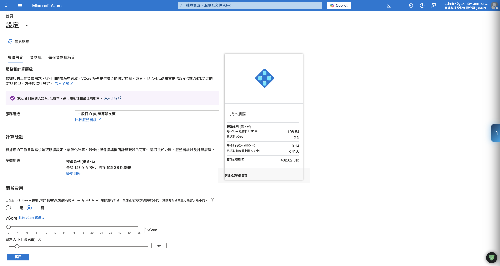
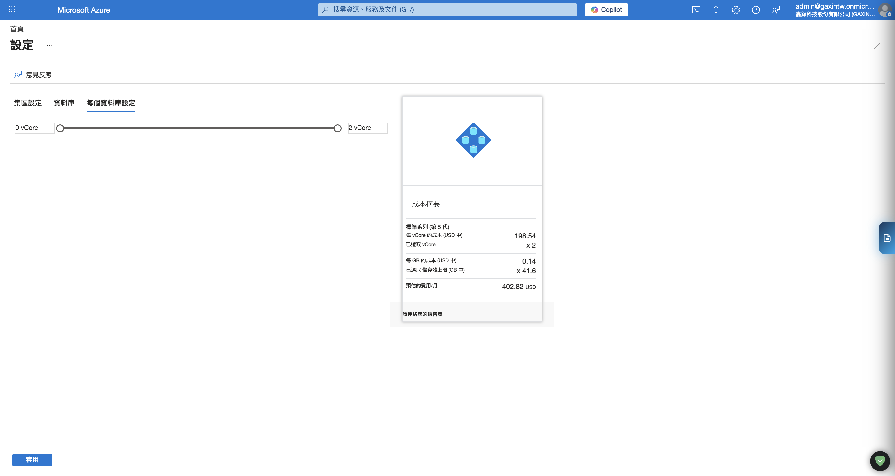
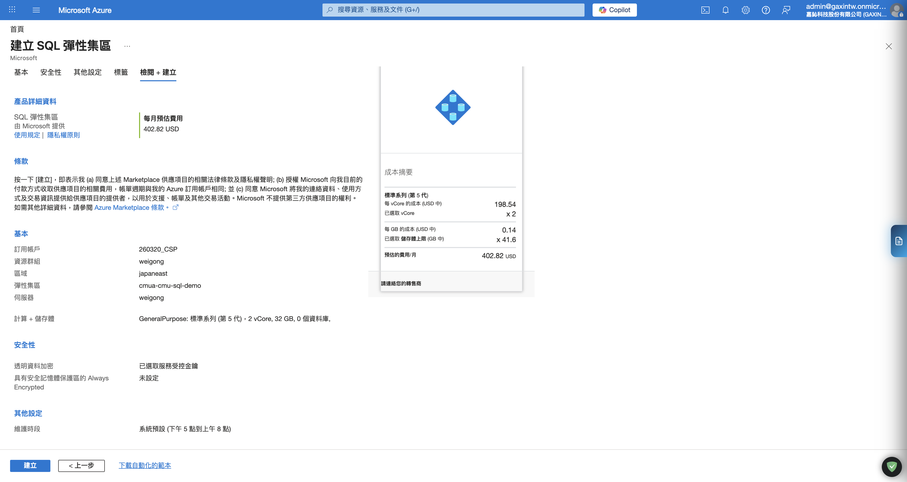
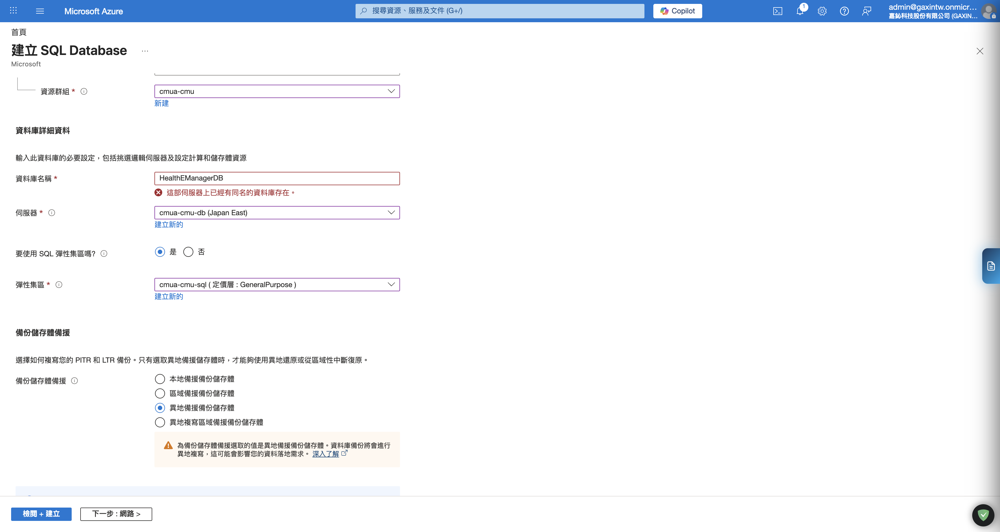
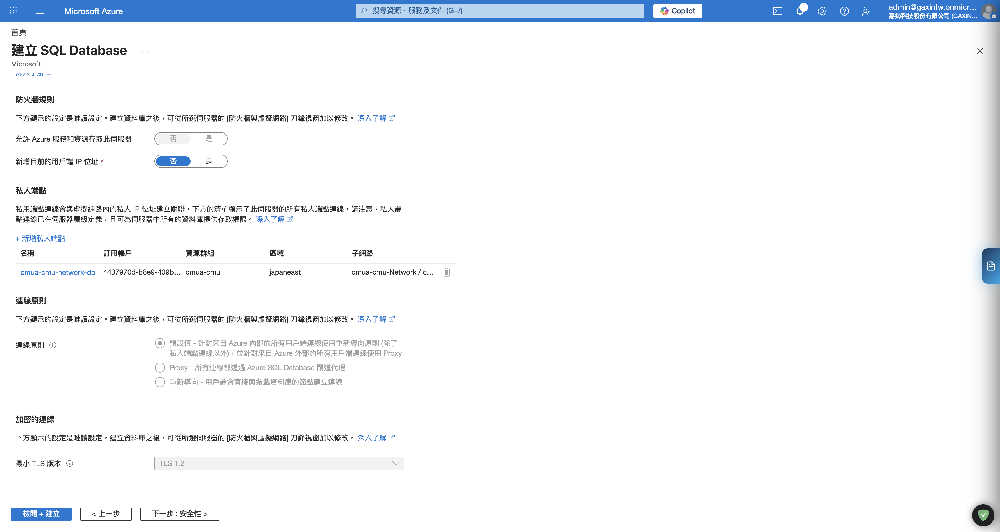
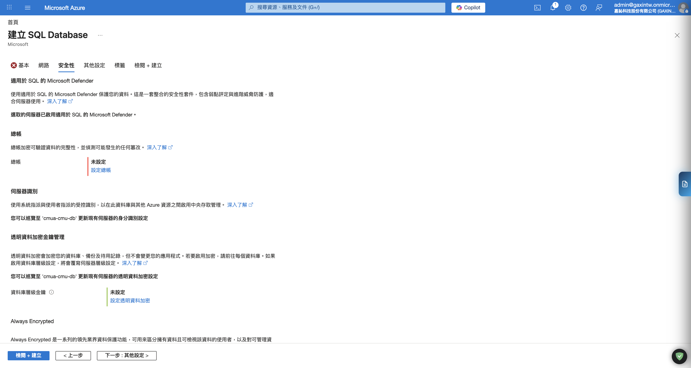
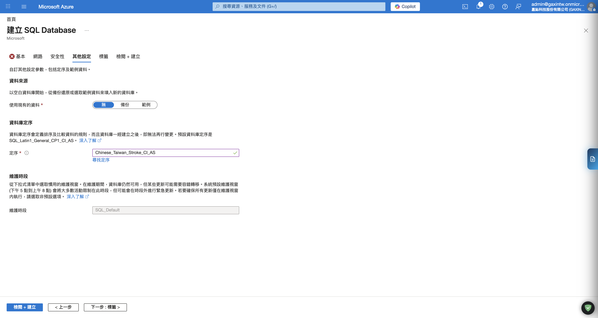
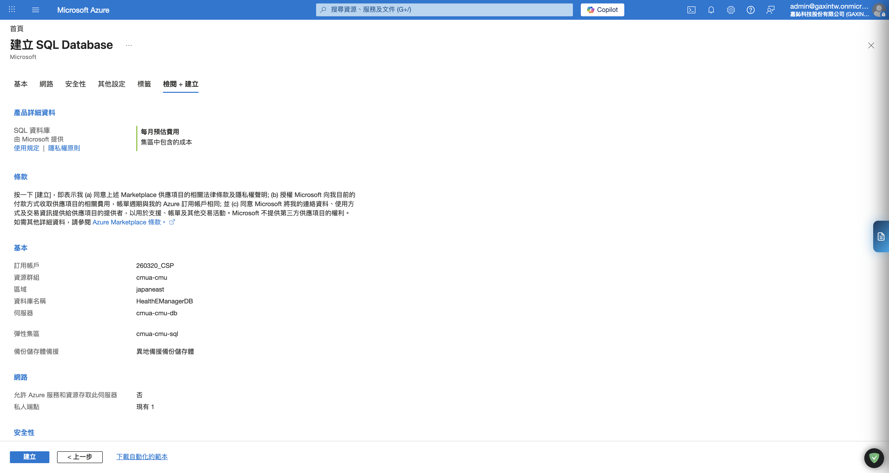

# Azure SQL Database 建立與配置指南 (Setup Guide)

本指南詳細記錄在 Azure 上建立 SQL Database 的標準流程、網路安全配置及關鍵的定序設定。由於實務上採用資源共享機制，**請務必先建立彈性集區，再將新建的資料庫加入其中**。

## 1. 建立 Azure SQL 彈性集區 (Elastic Pool)

彈性集區（Elastic Pool）是管理多個資料庫資源的最優方案。透過集區，多個資料庫（如 `HangfireDB`、`weigongDB`）可以共用一組 eDTU 或 vCore，這在負載不均的環境下能大幅節省成本。

### 步驟 1：建立彈性集區資源 (Resource Creation)
這是預先定義資源池的動作，必須在建立資料庫前完成：

1.  **導覽**
    *   進入 Azure Portal。
    *   在上方搜尋列輸入 **`SQL elastic pools`** 或從左側服務選單進入 **`Azure SQL > Elastic pools`**。
    *   進入 `Elastic pools` 清單頁後，點擊上方 **「建立」**。

    下圖可確認 Azure Portal 中 `Azure SQL > Elastic pools` 的入口位置：

    

2.  **基本設定 (Basics)**
    *   **訂用帳戶 (Subscription)**：選擇專案使用的訂用帳戶，例如 `260320_CSP`。
    *   **資源群組 (Resource group)**：選擇目標資源群組，例如 `cmua-cmu`。
    *   **名稱 (Name)**：輸入彈性集區名稱，例如 `cmua-cmu-sql`。
    *   **伺服器 (Server)**：選取要承載資料庫的 SQL Server，例如 `cmua-cmu-db`。
    *   **位置 (Location)**：通常會跟隨伺服器，不需另外調整；確認與現有 SQL Server 一致即可。

    下圖可對照 `Elastic pools` 清單頁上方的 **建立** 按鈕入口：

    

3.  **設定容量與計價層**
    *   在 Basics 頁面中找到 **「設定彈性集區 / Configure elastic pool」** 或類似的設定連結並點入。
    *   先確認目前使用的是哪一種購買模型：
        *   **DTU 模式**：畫面通常會顯示 `Standard`、`Premium` 與 `eDTU`。
        *   **vCore 模式**：畫面通常會顯示 `General Purpose`、`Business Critical`、`vCore`。
    *   本專案若延續現有共用資源邏輯，重點是**讓多個資料庫共用同一個 pool**，因此模式請與既有環境一致，不要混用。

    下圖為 **建立 SQL 彈性集區** 的 `基本 (Basics)` 頁面，可對照訂用帳戶、資源群組、名稱、伺服器，以及 `設定彈性集區` 入口：

    

4.  **設定集區總資源 (Pool settings)**
    *   **若為 DTU 模式**：
        *   **服務層級**：建議選 `Standard`。
        *   **eDTUs**：依目前規劃設定，例如 **`50 eDTUs`**。
        *   **儲存體 (Storage)**：依資料庫總量預估設定，例如先保守抓一個可接受的容量，後續再擴充。
    *   **若為 vCore 模式**：
        *   **服務層級**：建議選 `General Purpose`。
        *   **Compute**：依環境需求選擇適當 vCore。
        *   **儲存體 (Storage)**：依資料量設定。
    *   原則是：**先對齊現有環境的購買模型與等級，再決定數值大小**。

    下圖為建立流程中的 `集區設定 (Pool settings)`，可對照 `服務層級`、`硬體組態`、`vCore` 與 `資料大小上限`：

    

5.  **設定每個資料庫可用資源 (Per database settings)**
    *   這一步是 Elastic Pool 最容易漏掉、但影響最大的地方。
    *   **最小資源 (Min)**：
        *   建議設為 **`0`**。
        *   這代表資料庫閒置時不保留最低資源，能讓整體 pool 更有彈性。
    *   **最大資源 (Max)**：
        *   建議設為與 pool 上限相同，或至少足夠讓單一資料庫在尖峰時能吃到需要的資源。
        *   例如 pool 為 `50 eDTUs`，可先設 **`50`**。
    *   這樣做的目的是避免某一顆資料庫在短時間需要資源時，被過低的 Max 卡住。

    下圖為建立流程中的 `每個資料庫設定 (Per database settings)` 分頁，可直接對照 Min/Max 範圍：

    

6.  **預覽成本與確認設定**
    *   確認月估成本、服務層級、總資源、每資料庫 Min/Max 都正確。
    *   若畫面有 `Apply`、`OK` 或 `套用`，先套用回建立頁。

    下圖右側可看到建立流程中的 `成本摘要`，確認 vCore、儲存體與月費估算：

    

7.  **建立 Elastic Pool**
    *   回到建立頁後再次確認：
        *   訂用帳戶正確
        *   資源群組正確
        *   名稱正確
        *   伺服器正確
        *   Pool 規格已經套用
    *   點擊 **「檢閱 + 建立」**，確認無誤後建立。

    下圖為建立流程的 `檢閱 + 建立` 頁面，可在建立前再次確認名稱、伺服器與計算規格：

    

8.  **建立後檢查**
    *   進入剛建立的 Elastic Pool，例如 `cmua-cmu-sql`。
    *   確認 `Overview` 或 `設定 / Configure` 頁面中可看到：
        *   正確的 SQL Server
        *   正確的資源群組
        *   正確的購買模型與容量
    *   後續建立 SQL Database 時，再把新資料庫加入這個 pool。

    下圖同樣可作為建立前最後確認使用，檢查名稱、伺服器與計算規格是否正確後，再執行建立：

    

## 2. 建立 SQL Database 並加入集區

為了確保資料庫符合專案規範（特別是定序與網路安全），請依照以下步驟於 Azure Portal 進行建立：

### 步驟 1：基本設定與選取集區 (Basics)
*   **訂用帳戶與資源群組**：選擇對應的訂用帳戶，資源群組建議選擇 `RG-DB-PROD`。
*   **資料庫名稱**：輸入符合命名規範的名稱（例如 `weigongDB`）。
*   **伺服器**：選擇現有的伺服器（必須與彈性集區所在的伺服器相同）。
    *   *若需新建*: 建議使用「SQL 驗證」或「Microsoft Entra 驗證」。
*   **彈性集區設定**：
    *   找到 **「想要使用 SQL 彈性集區嗎? (Want to use SQL elastic pool?)」**，切換開關至 **「是 (Yes)」**。
    *   在下拉選單中選取剛才建立的集區名稱（例如 `cmua-cmu-sql`）。
    *   *提示*: 加入集區後，「運算 + 儲存體」設定將會消失，因為資源已改由集區統一分配。

下圖為本次實際操作畫面，建立 `HealthEManagerDB` 時已選擇：
*   **伺服器**：`cmua-cmu-db`
*   **彈性集區**：`cmua-cmu-sql`

### 步驟 2：網路設定 (Networking)
*   **連線方式**：**務必選擇「私用端點 (Private endpoint)」**。
    *   若伺服器底下已存在私人端點，建立資料庫時會直接顯示在此清單中。
    *   本次實際環境中，`cmua-cmu-db` 已有既有私人端點 `cmua-cmu-network-db`，因此不需重新新增。
*   **防火牆規則**：
    *   「允許 Azure 服務和資源存取此伺服器」：**否**。
    *   「新增目前的用戶端 IP 位址」：視維護需求暫時開啟，完成後建議關閉。
*   **連線原則**：建議維持「預設」。

下圖為 `建立 SQL Database > 網路` 實際畫面，建立時請在此頁面完成連線方式與私人端點相關設定：

### 步驟 3：安全性 (Security)
*   此步驟**不需特別調整**，維持預設即可。
*   **Microsoft Defender for SQL**：可依 Azure Portal 預設值維持，不列為必要設定。
*   **總帳 (Ledger)**：維持預設關閉即可，非本流程必要項目。

下圖為 `建立 SQL Database > 安全性` 畫面；本流程維持預設即可：

### 步驟 4：其他設定 (Additional settings) - **重要**
*   **定序 (Collation)**：**此為最關鍵步驟**。
    *   **預設定序為 `SQL_Latin1_General_CP1_CI_AS`，必須手動修改為：**
    *   **`Chinese_Taiwan_Stroke_CI_AS`**
    *   *說明*: 若漏掉此步驟，未來中文字元排序將會出現異常（如無法按筆劃排序）。
*   **維護視窗**：視業務離峰時間設定。

下圖為 `建立 SQL Database > 其他設定` 畫面，請特別留意定序欄位已改為 `Chinese_Taiwan_Stroke_CI_AS`：

### 步驟 5：檢閱 + 建立 (Review + Create)
*   最後確認所有資訊無誤後，點擊「建立」。部署通常需要 2-5 分鐘。

下圖為 `建立 SQL Database > 檢閱 + 建立` 畫面，送出前請再次確認是否已加入正確的彈性集區與網路設定：

## 3. 常見問題與檢查清單
* [ ] 檢查 Private DNS Zone 是否已正確關聯至 VNet。
* [ ] 確認定序是否為 `Chinese_Taiwan_Stroke_CI_AS`。
* [ ] 驗證私人端點 IP 是否可從 `BackendSubnet` 的 VM 連通。
