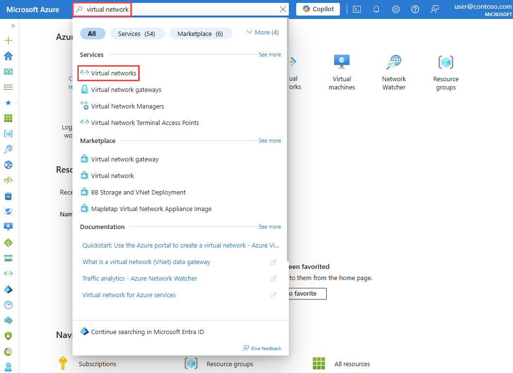
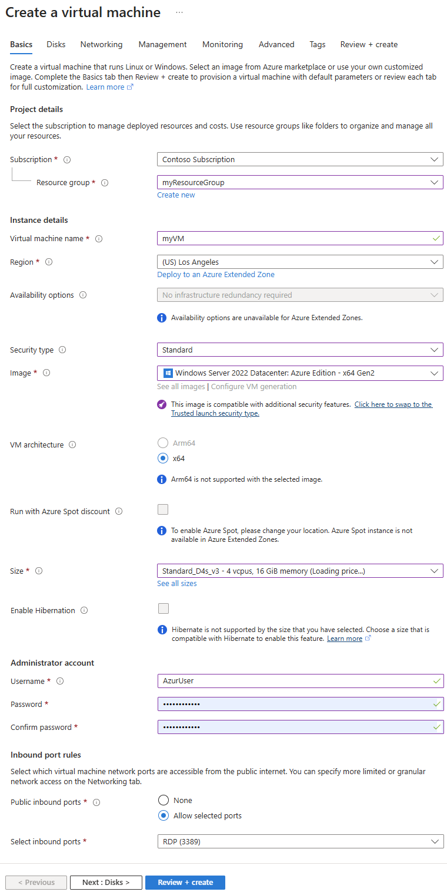
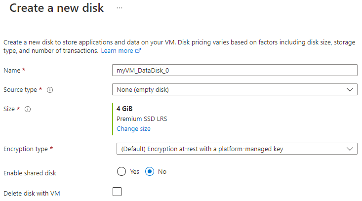
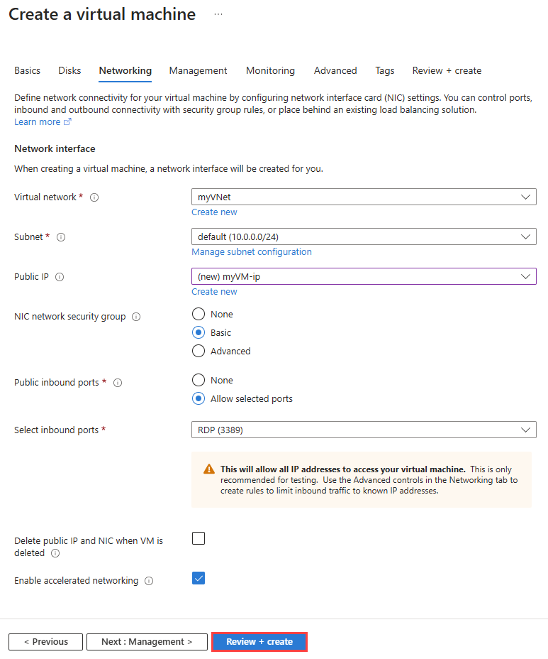
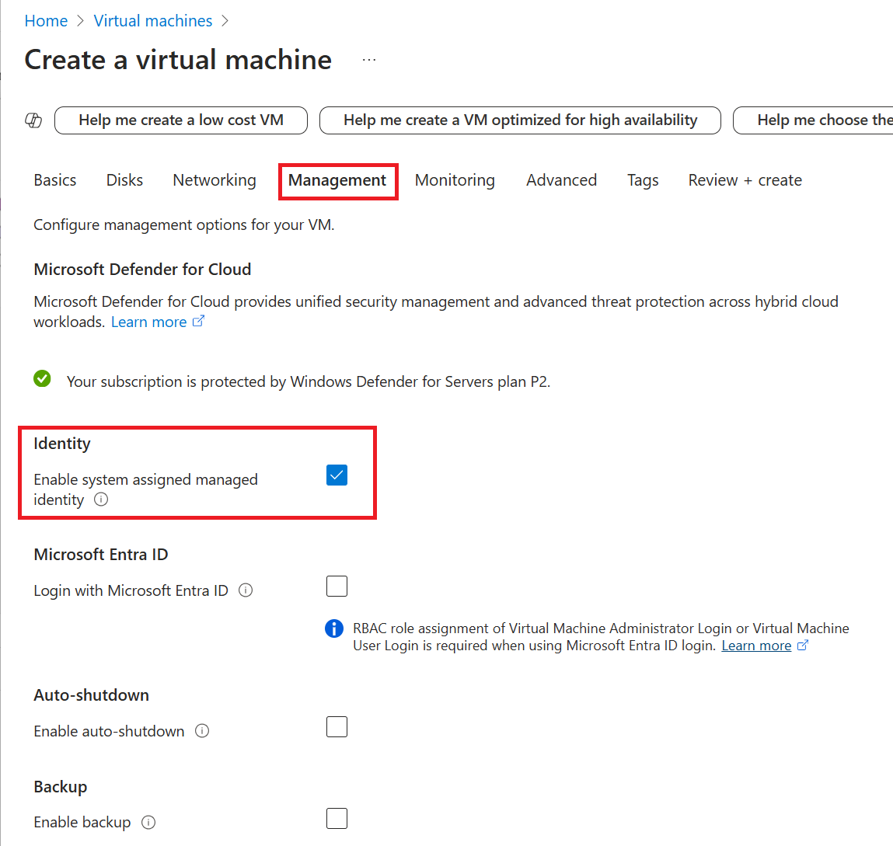
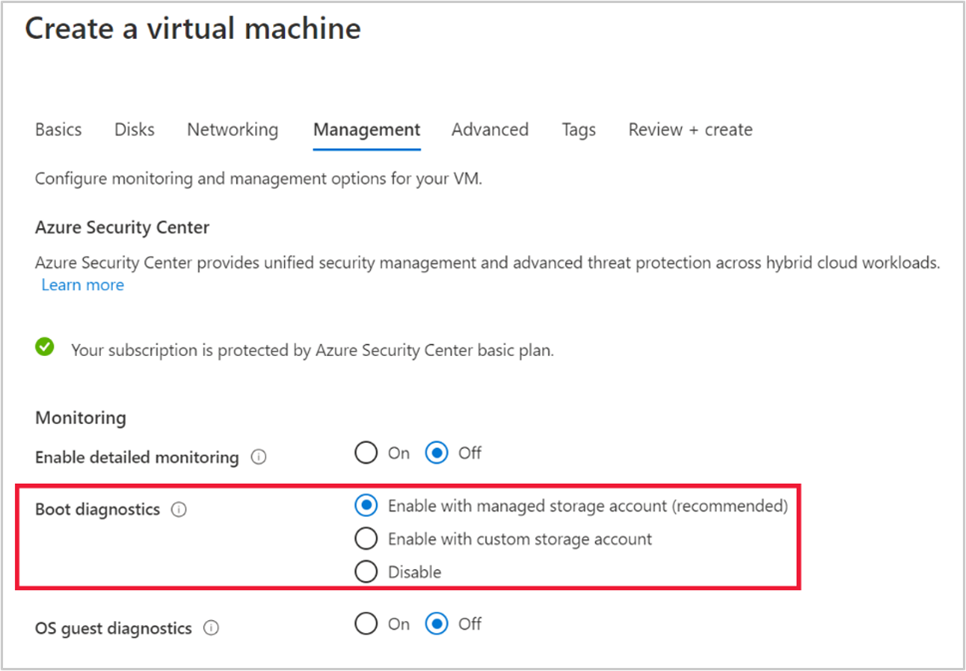
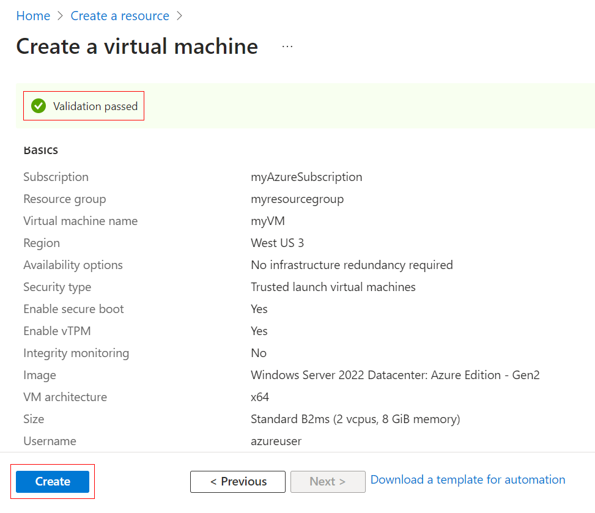

# Azure VM 建立與配置指南 (CMUA)

本文件整理 `CMU Alliance` 專案在 Azure 上建立應用伺服器 VM 的標準流程。內容以目前可確認的 `cmua` 既有資源命名與網路配置為基準，建立新 VM 時請優先沿用既有規格，不要任意改成 Azure 預設值。

目前已能從專案既有文件與 Azure SQL 建置紀錄對齊的 `cmua` 規格如下：

* 資源群組為 `cmua-cmu`
* SQL Server 為 `cmua-cmu-db`
* Elastic Pool 為 `cmua-cmu-sql`
* SQL Private Endpoint 為 `cmua-cmu-network-db`

因此 VM 端的網路與命名，應以「可私網連到 `cmua-cmu-db`、並延續 `cmua-cmu` 既有資源配置」為原則，不可另外建立一套獨立 VNet 或直接加上 Public IP。

## 0. 目前已確認的 VM 規格

以下內容是目前可從專案文件、既有 SQL 建置紀錄與網路架構文件交叉確認的 `cmua` VM 規格。由於這一輪無法穩定直接讀取 Azure Portal 的即時頁面，因此 `Image`、`Size`、`OS Disk type` 這類需進入 VM 詳細頁才能完全確認的欄位，先標記為待現場補查。

| 項目 | 目前規格 | 狀態 |
| :--- | :--- | :--- |
| **資源群組** | `cmua-cmu` | 已確認 |
| **區域** | `Japan East` | 已確認 |
| **VM 命名** | `ap1`、`ap2` | 已確認 |
| **子網路** | `BackendSubnet` | 已確認 |
| **Public IP** | `None` | 已確認 |
| **NIC NSG** | `ap1-nsg`、`ap2-nsg` | 已確認 |
| **SQL 私網連線目標** | `cmua-cmu-db` | 已確認 |
| **Image** | 需以現場已建 VM 為準 | 待 Azure Portal 補查 |
| **VM Size** | 需以現場已建 VM 為準 | 待 Azure Portal 補查 |
| **OS Disk type** | 需以現場已建 VM 為準 | 待 Azure Portal 補查 |
| **Managed Identity** | `ap1` / `ap2` 皆為 `System assigned = On` | 已確認 |
| **Auto-shutdown** | `ap1` / `ap2` 皆為 `Disabled` | 已確認 |
| **Boot diagnostics** | `ap1` / `ap2` 皆為 `Disabled` | 已確認 |

## 1. 建立前確認

建立 VM 前，請先確認以下資源已存在：

| 項目 | 建議值 / 現況基準 | 說明 |
| :--- | :--- | :--- |
| **資源群組** | `cmua-cmu` | 目前 CMUA 相關 SQL / 網路資源已使用此資源群組 |
| **區域** | `Japan East` | 請與既有資源保持一致 |
| **命名方式** | `ap1`, `ap2` | 應用伺服器請依既有命名規則延續 |
| **子網路** | `BackendSubnet` | 應用層 VM 應放在後端子網，並能連到 `cmua-cmu-db` 的私網路徑 |
| **公用 IP** | `None` | 不可直接暴露在公網 |
| **NIC 安全群組** | `ap1-nsg` / `ap2-nsg` | 依 VM 對應名稱配置 |

## 2. 建立 Azure VM 流程

### 步驟 1：進入建立畫面

1. 登入 Azure Portal。
2. 在上方搜尋列輸入 `Virtual machines`。
3. 進入 `Virtual machines` 清單後，點擊 **`+ Create`**。
4. 選擇 **`Azure virtual machine`**。

操作重點：

* 若你是比對現有環境，先進入 `Virtual machines` 清單確認目前是否已經存在 `ap1`、`ap2`。
* 若是要新增節點，請直接從同一個入口建立，避免從其他精靈入口帶入不一致預設值。

**參考擷圖：進入 Azure Portal 搜尋服務**

### 步驟 2：基本設定 (Basics)

在 `Basics` 分頁請依下列原則填寫：

| 欄位 | 建議填法 |
| :--- | :--- |
| **Subscription** | 選擇專案使用中的訂用帳戶 |
| **Resource group** | `cmua-cmu` |
| **Virtual machine name** | `ap1` 或 `ap2` |
| **Region** | `Japan East` |
| **Availability options** | 視環境需求選擇，若已有 HA 規劃可維持現況 |
| **Security type** | 維持預設或依公司安全政策調整 |
| **Image** | 依應用程式相容需求選擇，避免自行改用不一致版本 |
| **Size** | 請對齊既有 CMUA VM 規格，不要任意升降規 |
| **Username** | 依維運帳號命名規範設定 |
| **Public inbound ports** | `None` |

重點：

* `VM name` 請沿用 `ap1` / `ap2` 這種短名稱規則。
* `Region` 必須與既有 `cmua` 資源一致，避免跨區造成延遲與管理複雜度。
* `Public inbound ports` 一律選 `None`。

建議操作順序：

1. 先選好 **Subscription** 與 **Resource group = cmua-cmu**。
2. 在 **Virtual machine name** 輸入本次要建立的名稱，例如 `ap1` 或 `ap2`。
3. **Region** 選 `Japan East`。
4. **Image**、**Size** 不要直接用 Azure 預設值，請先比對現場既有 VM 規格後再填。
5. **Administrator account** 依維運規範填寫。
6. **Public inbound ports** 選 `None`。

**參考擷圖：Basics**

### 步驟 3：磁碟設定 (Disks)

在 `Disks` 分頁建議：

* **OS disk type**：以現有環境的磁碟類型為準，通常建議使用 `Premium SSD` 或與現況一致的等級。
* **Encryption type**：維持既有安全策略設定。
* 若有資料磁碟需求，請在建立時一併規劃，不要等上線後臨時調整磁碟結構。

原則：

* 新 VM 的磁碟規格應與既有節點一致，避免 `ap1` / `ap2` IO 表現差異太大。

建議操作順序：

1. 在 `Basics` 頁完成後，點 **`Next: Disks`**。
2. 先確認 **OS disk type** 是否與既有 VM 相同。
3. 若應用程式需要額外資料碟，再於 **Data disks** 區塊新增磁碟。
4. 若現場 `ap1` / `ap2` 沒有額外資料碟，就維持同樣做法，不要多加一顆新磁碟。

**參考擷圖：切換到 Disks 分頁**

**參考擷圖：新增資料磁碟**

### 步驟 4：網路設定 (Networking)

這一步是 VM 建立最重要的步驟之一，請依 `cmua` 現有網路架構處理：

| 欄位 | 建議值 |
| :--- | :--- |
| **Virtual network** | 選擇 CMUA 既有 VNet，且該 VNet 已能透過私有 DNS / Private Endpoint 連到 `cmua-cmu-db` |
| **Subnet** | `BackendSubnet` |
| **Public IP** | `None` |
| **NIC network security group** | `Advanced`，並綁定對應的 `ap1-nsg` 或 `ap2-nsg` |
| **Load balancing** | 視是否要加入既有 Application Gateway / Backend Pool 決定 |

重點：

* 不可建立新的公用 IP。
* 應用 VM 必須放在 `BackendSubnet`，不可誤放到 `DataSubnet` 或 `AppGatewaySubnet`。
* NSG 必須沿用既有命名與規則，避免把 VM 直接暴露給 Internet。
* 若建立完成後 VM 無法解析或連線到 `cmua-cmu-db`，代表 VNet / DNS / Private Endpoint 路徑沒有對齊既有 `cmua` 規格，不能直接上線。

建議操作順序：

1. 選擇既有 `cmua` 使用的 **Virtual network**。
2. **Subnet** 必須選 `BackendSubnet`。
3. **Public IP** 改成 `None`。
4. **NIC network security group** 選 `Advanced`。
5. 綁定對應 NSG，例如 `ap1` 綁 `ap1-nsg`、`ap2` 綁 `ap2-nsg`。
6. 若 VM 需要放進既有流量架構，再確認是否需加入既有 Backend Pool 或由後續作業處理。

**參考擷圖：Networking**

### 步驟 5：管理設定 (Management)

在 `Management` 分頁建議設定如下：

* **System assigned managed identity**：`Enable`
* **Auto-shutdown**：開發環境建議啟用，正式環境依維運政策評估
* **Boot diagnostics**：`Enable`
* **Patch orchestration / 更新管理**：依公司維運視窗統一管理

### 目前既有 VM 實測狀態

以下為 2026-04-12 直接於 Azure Portal 查核 `cmua-cmu-ap1` 與 `cmua-cmu-ap2` 的結果：

| 項目 | `cmua-cmu-ap1` | `cmua-cmu-ap2` | 備註 |
| :--- | :--- | :--- | :--- |
| **System assigned managed identity** | `On` | `On` | 兩台皆已啟用 |
| **User assigned managed identity** | 未設定 | 未設定 | Portal 未看到已綁定的 user-assigned identity |
| **Auto-shutdown** | `Disabled` | `Disabled` | 兩台皆未啟用排程關機 |
| **Boot diagnostics** | `Disabled` | `Disabled` | 兩台 `開機診斷` 頁面皆顯示未設定 |

也就是說，現況有沿用 **Managed Identity**，但 **Auto-shutdown** 與 **Boot diagnostics** 並未啟用。

Managed Identity 是這份流程的必要項目，因為：

* 後續若要讀取 Key Vault 秘密或與其他 Azure 服務整合，會用到 VM 自身身分
* 可以減少硬編碼帳密的風險

建議操作順序：

1. 切到 **Management** 分頁。
2. 開啟 **System assigned managed identity**。
3. 視環境決定是否開啟 **Auto-shutdown**。
4. 先確認 **Boot diagnostics** 不要關閉。
5. 其餘維持與既有 VM 相同的管理策略。

**參考擷圖：Managed Identity**

### 步驟 6：監控與診斷 (Monitoring)

在 `Monitoring` 或相近分頁請確認：

* **Boot diagnostics**：已啟用
* **Guest OS diagnostics / VM insights / Log Analytics**：依現有監控方案納入
* 若專案已有集中式 Log Analytics Workspace，請在建立後立即完成代理程式或監控延伸模組配置

原則：

* 新 VM 不可成為監控盲點
* 至少要能從 Azure 端看到開機、狀態與診斷資訊

建議操作順序：

1. 在 **Monitoring** 或相關管理區塊確認 **Boot diagnostics = Enable**。
2. 若畫面有 **Enable detailed monitoring**、**VM insights** 等選項，請依現有環境監控策略處理。
3. 建立完成後，另外確認是否要補掛 Log Analytics / Azure Monitor Agent。

**參考擷圖：Boot diagnostics**

### 步驟 7：檢閱 + 建立 (Review + Create)

送出前請逐項確認：

* 資源群組是否為 `cmua-cmu`
* 區域是否為 `Japan East`
* VM 名稱是否符合 `ap1` / `ap2` 命名規則
* 網路是否在 `BackendSubnet`
* 是否未建立 `Public IP`
* 是否綁定正確的 NSG
* Managed Identity 是否已啟用
* Boot diagnostics 是否已啟用

確認完成後再按 **`Create`**。

**參考擷圖：Review + Create**

## 3. 建立後檢查清單

* [ ] VM 位於正確資源群組 `cmua-cmu`
* [ ] VM 位於 `Japan East`
* [ ] NIC 沒有綁定公用 IP
* [ ] NIC 綁定正確 NSG
* [ ] VM 位於 `BackendSubnet`
* [ ] Managed Identity 已啟用
* [ ] Boot diagnostics 已啟用
* [ ] 已納入監控與日誌收集

## 4. 與現有架構的關聯

本文件建立的 VM 預設是應用層節點，主要用途如下：

* 作為 `ap1` / `ap2` 應用主機
* 接收來自 Application Gateway 的內部流量
* 透過私有網路存取 Azure SQL 與其他內部資源
* 不直接對 Internet 開放管理埠

## 5. 注意事項

* 本流程已優先參考 `cmua-cmu`、`cmua-cmu-db`、`cmua-cmu-sql` 與既有私網資料庫路徑來整理 VM 建立原則。
* 目前瀏覽器讀取 Azure Portal 畫面不穩定，因此這份文件先以已確認的 `cmua` 資源規格為準，`Image`、`Size`、`OS Disk type` 仍待從現場已建 VM 補查。
* 目前附上的圖片已改為本地 `assets` 檔案，來源為 Microsoft Learn 官方 Azure Portal 示意圖，用來對照建立頁籤位置與欄位名稱。
* 後續若能穩定取得 `cmua` 實際 VM 建立畫面，建議再把本文件中的參考圖替換成專案現場擷圖。
