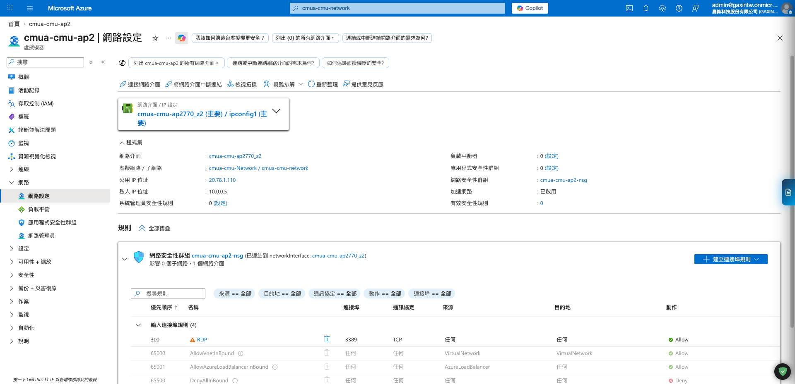
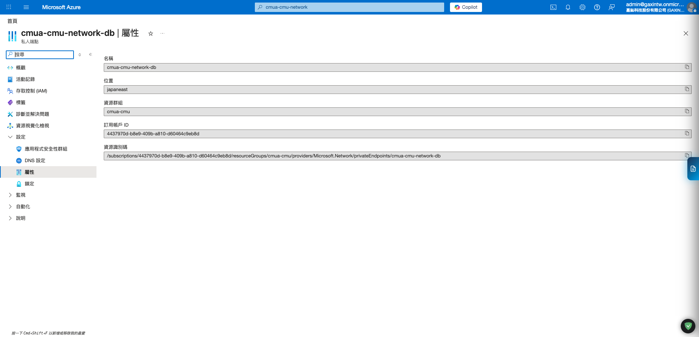
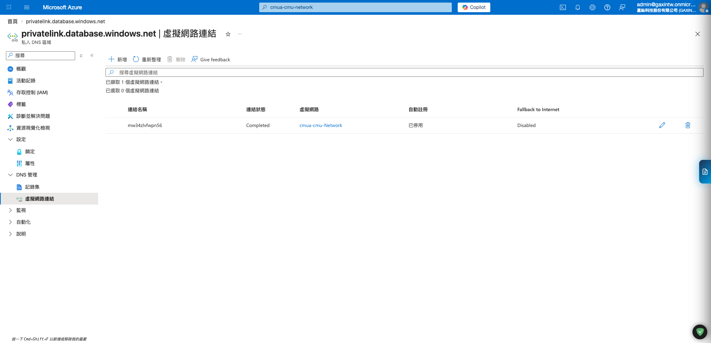

# Azure 虛擬網路建立與設定指南 (CMUA)

本文件整理 `CMU Alliance` 專案在 Azure 上建立或補齊虛擬網路 (`VNet`) 與子網路 (`Subnet`) 的標準流程。內容以目前 `cmua` 實際環境與既有 VM / SQL 私網連線需求為基準，目標是讓 `ap1`、`ap2`、Application Gateway 與 SQL Private Endpoint 使用同一套可維運的私網架構。

文內擷圖為 2026-04-12 自 Azure Portal 擷取的現場畫面，主要作為辨識頁面與操作位置參考；若 Azure 介面版本更新，請以同名資源與功能區塊為準。

## 0. 先看現況再動手

在撰寫這份文件時，專案內較早期的總覽文件仍有 `weigong` 命名示意，但目前 `CMUA` 實際 Azure Portal 中已可看到：

* 應用 VM 為 `cmua-cmu-ap1`、`cmua-cmu-ap2`
* Resource Group 為 `cmua-cmu`
* SQL Server 為 `cmua-cmu-db`
* SQL Private Endpoint 為 `cmua-cmu-network-db`
* VM 掛載的既有虛擬網路顯示為 `cmua-cmu-Network/...`

因此後續若要新增或調整 VNet，請以 **現場既有 `cmua` 網路資源為準**，不要再另外新建一套 `weigong` 命名的 VNet。

## 1. 目標網路架構

`CMUA` 專案建議維持下列分層：

| 區塊 | 建議名稱 | 用途 |
| :--- | :--- | :--- |
| **Virtual Network** | 沿用既有 `cmua` VNet | 專案核心私網骨幹 |
| **AppGatewaySubnet** | `AppGatewaySubnet` | 僅供 Azure Application Gateway 使用 |
| **BackendSubnet** | `BackendSubnet` | 放置 `ap1`、`ap2` 等應用 VM |
| **DataSubnet** | `DataSubnet` | 放置 SQL Private Endpoint 等資料層私網端點 |

原則：

* `AppGatewaySubnet` 不可混放 VM 或 Private Endpoint。
* `BackendSubnet` 只放應用層 VM。
* `DataSubnet` 只放資料層 Private Endpoint，避免和應用 VM 混用。
* 應用 VM 必須能透過 Private DNS / Private Endpoint 解析並連到 `cmua-cmu-db`。

## 2. 建立前確認

進 Azure Portal 建立前，先確認以下條件：

| 項目 | 建議值 / 現況基準 | 說明 |
| :--- | :--- | :--- |
| **Subscription** | 專案既有訂用帳戶 | 與 `cmua-cmu` VM / SQL 相同 |
| **Resource group** | `cmua-cmu` 或既有網路專用 RG | 以現場網路資源實際所在 RG 為準 |
| **Region** | `Japan East` | 必須和現有 VM / SQL 一致 |
| **VNet 位址空間** | 不可與既有 VNet / VPN / On-prem 衝突 | 新增前先比對已使用 CIDR |
| **Private DNS Zone** | 可解析 `privatelink.database.windows.net` | 供 `cmua-cmu-db` 私網解析使用 |
| **Private Endpoint 需求** | `cmua-cmu-network-db` 已存在時不可重複建 | 若只是補文件或新增 VM，不代表要重建 PE |

## 3. 建立 Azure VNet 流程

以下流程刻意寫成「照著 Portal 點」的形式。若現場已經有符合規格的 VNet，可以跳過建立步驟，直接改做第 7 節的驗證。

### 步驟 1：確認是否已存在可沿用的 VNet

1. 登入 Azure Portal。
2. 在上方搜尋列輸入 `Virtual networks`。
3. 進入 `Virtual networks` 清單。
4. 用名稱、Resource Group、Region 篩選，確認是否已有 `cmua` 既有 VNet。
5. 如果已經存在，而且已被 `ap1` / `ap2` / `cmua-cmu-db` 使用，優先沿用，不要重建。
6. 只有在現場沒有可沿用的 VNet 時，才往下建立新的 VNet。

判斷標準：

* 名稱應與 `cmua` 資源一致。
* Region 必須是 `Japan East`。
* 後續 VM 與 SQL 私網架構都要能掛上去。

### 步驟 2：進入建立 VNet 畫面

1. 在 `Virtual networks` 清單頁按 **`+ Create`**。
2. 選擇 **`Virtual network`**。
3. 進入建立精靈後，先停在 `Basics` 分頁。

### 步驟 3：填寫 Basics 分頁

在 `Basics` 分頁逐欄處理：

| 欄位 | 操作方式 | 建議值 |
| :--- | :--- | :--- |
| **Subscription** | 下拉選擇專案訂用帳戶 | 與 `cmua-cmu` VM / SQL 相同 |
| **Resource group** | 選既有 RG 或新建 RG | 以現場網路資源所在 RG 為準 |
| **Name** | 輸入 VNet 名稱 | 沿用 `cmua` 既有命名 |
| **Region** | 下拉選區域 | `Japan East` |

實際操作順序：

1. 先選 **Subscription**。
2. 再選 **Resource group**。
3. 在 **Name** 輸入 VNet 名稱。
4. **Region** 選 `Japan East`。
5. 確認沒有誤填成舊文件示意值 `weigong`。
6. 點 **`Next: IP addresses`**。

### 步驟 4：在 IP addresses 分頁設定 VNet Address Space

這一步先建立整體 VNet 的位址空間，不要急著只建子網路。

操作順序：

1. 在 **IPv4 address space** 區塊輸入 VNet CIDR。
2. 檢查此 CIDR 不會和現有：
   - 其他 Azure VNet
   - VPN Gateway 連線網段
   - On-prem 網段
   發生衝突。
3. 若畫面內已有預設子網路，先不要直接使用，先看是否符合規劃。
4. 確認 VNet address space 足夠容納三個角色型子網路：
   - `AppGatewaySubnet`
   - `BackendSubnet`
   - `DataSubnet`

原則：

* 不要把整個 VNet 切太小，導致之後 Application Gateway 或 Private Endpoint 沒空間。
* 不要讓 `BackendSubnet` 跟 `DataSubnet` 共用同一段。

### 步驟 5：建立 AppGatewaySubnet

1. 在 `IP addresses` 分頁的子網路區塊，按 **`+ Add subnet`**。
2. `Subnet name` 輸入 `AppGatewaySubnet`。
3. 指定此子網的 CIDR。
4. 儲存子網設定。

建立時要注意：

* 這個子網只給 Application Gateway 用。
* 不要把 VM NIC 掛到這裡。
* 不要把 SQL Private Endpoint 建到這裡。
* 若未來有 WAF / 多執行個體擴充，CIDR 不要切得過小。

### 步驟 6：建立 BackendSubnet

1. 再按一次 **`+ Add subnet`**。
2. `Subnet name` 輸入 `BackendSubnet`。
3. 指定此子網的 CIDR。
4. 儲存子網設定。

建立時要注意：

* `ap1`、`ap2` 這類應用 VM 都應該掛在這個子網。
* 後續 VM NIC 會再搭配 `ap1-nsg`、`ap2-nsg` 使用。
* 這一段子網需要能透過 Private DNS + Private Endpoint 連到 `cmua-cmu-db`。

### 步驟 7：建立 DataSubnet

1. 再按 **`+ Add subnet`**。
2. `Subnet name` 輸入 `DataSubnet`。
3. 指定此子網的 CIDR。
4. 儲存子網設定。

建立時要注意：

* 這一段保留給資料層 Private Endpoint。
* `cmua-cmu-network-db` 這類 SQL Private Endpoint 應落在這個子網。
* 不要把 `ap1`、`ap2` 放到這裡。

### 步驟 8：檢查預設子網路與其他自動產生設定

1. 檢查畫面中是否存在 `default` 子網路。
2. 若現場政策不使用 `default`，可在建立後再刪除或保留但不掛載工作負載。
3. 確認沒有任何正式用途的 VM / Private Endpoint 規劃落在 `default`。
4. 確認三個正式子網名稱拼法正確：
   - `AppGatewaySubnet`
   - `BackendSubnet`
   - `DataSubnet`

### 步驟 9：Review + Create

1. 點 **`Review + create`**。
2. 等 Azure 完成欄位驗證。
3. 逐項確認：
   - Subscription 正確
   - Resource Group 正確
   - Name 正確
   - Region = `Japan East`
   - VNet address space 正確
   - 三個子網都已建立
4. 無誤後按 **`Create`**。
5. 等部署完成，再進入資源詳細頁做後續設定。

## 4. 子網路設定原則

### AppGatewaySubnet

用途：

* 僅供 Azure Application Gateway 使用。

設定原則：

* 不要把 `ap1`、`ap2` 放進來。
* 不要把 SQL Private Endpoint 放進來。
* 若未來有 WAF / 多執行個體需求，CIDR 不要切太小。

### BackendSubnet

用途：

* 放置 `ap1`、`ap2` 應用 VM。

設定原則：

* `ap1`、`ap2` NIC 必須掛在這個子網路。
* 應搭配 `ap1-nsg`、`ap2-nsg` 等 VM 對應 NSG 使用。
* 應能經由 Private DNS 解析 `cmua-cmu-db`，並透過私網路徑連資料庫。

### DataSubnet

用途：

* 放置 `cmua-cmu-network-db` 這類資料層 Private Endpoint。

設定原則：

* 不放應用 VM。
* 不對外提供公網入口。
* 私有端點建立後，要同步確認 Private DNS Zone 關聯是否正常。

## 5. 建好 VNet 後要立刻做的設定

VNet / Subnet 建好後，不代表網路就可用了，接下來至少還要把 NSG、DNS、Private Endpoint 關聯補齊。

### 步驟 10：確認 Backend VM 對應的 NSG

1. 進入 `ap1` 與 `ap2` 的 VM 頁面。
2. 打開 **Networking**。
3. 檢查 NIC 是否位於 `BackendSubnet`。
4. 檢查 `ap1` 是否綁 `ap1-nsg`。
5. 檢查 `ap2` 是否綁 `ap2-nsg`。

參考擷圖：

### 步驟 11：確認 Application Gateway 的子網路位置

1. 進入 Application Gateway 資源頁。
2. 檢查它是否掛在 `AppGatewaySubnet`。
3. 確認沒有誤掛到 `BackendSubnet` 或 `DataSubnet`。

### 步驟 12：確認 SQL Private Endpoint 的子網路位置

1. 進入 `cmua-cmu-network-db` Private Endpoint。
2. 檢查其所在 VNet 是否為本次建立或沿用的 `cmua` VNet。
3. 檢查其所在 Subnet 是否為 `DataSubnet`。

參考擷圖：

## 6. NSG 與路由建議

VNet / Subnet 建好後，請同步檢查：

| 項目 | 建議 |
| :--- | :--- |
| **Backend VM NSG** | `ap1-nsg` / `ap2-nsg` 只允許必要內網流量 |
| **App Gateway 路徑** | 若有前端入口，應只允許 App Gateway 子網進入應用服務必要埠 |
| **Public inbound** | 應用 VM 不直接開公網埠 |
| **UDR / Route table** | 若現場有 VPN / Firewall / NVA，需一併確認路由是否正確 |

重點：

* 若 `ap1` / `ap2` 已綁公用 IP，應視維運需求再評估是否保留；理想目標仍是私網優先。
* NSG 規則、Application Gateway 後端探查與 VNet 子網規劃要一起看，不能只改其中一塊。

## 7. Private DNS 與資料庫私網連線確認

VNet 建好之後，至少要做以下檢查：

### 步驟 13：確認 Private DNS Zone 關聯

1. 進入 `Private DNS zones`。
2. 打開 `privatelink.database.windows.net`。
3. 檢查 **Virtual network links**。
4. 確認本次使用的 `cmua` VNet 已建立連結。

參考擷圖：

### 步驟 14：確認 SQL Private Endpoint

1. 進入 `cmua-cmu-network-db`。
2. 檢查其狀態為成功佈署且可用。
3. 檢查目標資源確實是 `cmua-cmu-db`。
4. 檢查其所在子網為 `DataSubnet`。

### 步驟 15：從 BackendSubnet 的 VM 驗證 DNS

1. 登入 `ap1` 或 `ap2`。
2. 於系統內執行 DNS 查詢，例如查 `cmua-cmu-db.database.windows.net`。
3. 確認解析結果是私網 IP，而不是公網位址。

### 步驟 16：從 BackendSubnet 的 VM 驗證資料庫連線

1. 在 `ap1` 或 `ap2` 上，用應用程式既有方式或測試工具連 `cmua-cmu-db`。
2. 確認連線走私網可成功建立。
3. 若解析正常但仍連不上，再檢查：
   - NSG 是否擋流量
   - Private Endpoint 狀態是否正常
   - DNS Zone 是否連錯 VNet
   - 應用程式連線字串是否錯誤

如果這一步失敗，代表不是單純 VM 問題，而是 **VNet / DNS / Private Endpoint** 三者其中至少有一段沒對齊。

## 8. 建立完成後檢查清單

送出前請確認：

* [ ] VNet 與 Subnet 名稱已對齊 `cmua` 現場命名
* [ ] Region 為 `Japan East`
* [ ] `AppGatewaySubnet` / `BackendSubnet` / `DataSubnet` 職責清楚
* [ ] `ap1` / `ap2` 預定放在 `BackendSubnet`
* [ ] SQL Private Endpoint 預定放在 `DataSubnet`
* [ ] Private DNS Zone 與 VNet 關聯規劃已確認
* [ ] 沒有為應用 VM 網路設計多餘的 Public IP 依賴
* [ ] NSG 與流量路徑有一起檢查

## 9. 與其他文件的關聯

建立或調整 VNet 後，請同步參考：

* [Azure SQL Database 建立步驟教學](./AZURE_SQL_SETUP_GUIDE.md)
* [Azure VM 建立與配置指南 (CMUA)](./AZURE_VM_SETUP_GUIDE.md)

若之後能從 Azure Portal 補齊既有 VNet 的 address space、每個 subnet 的 CIDR 與實際 RG 名稱，建議再把這份文件補成「可直接照抄欄位值」的版本。
